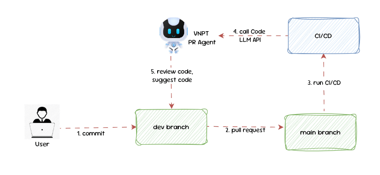

# Overview
**Pr-agent** is an AI-powered tool that streamlines the code review and merge process for GitLab repositories. I config it to use AI models through API to analyze, review, and improve merge requests, making collaboration and code quality enhancement more efficient.

# Setup
1.Create `.secrets.toml` file by copying `secrets_templates.toml` (in `settings`).

2.Set up model and fallback_moels in `configuration.toml`.
```yaml
model="ic_coding_assistant"
fallback_models=["ic_coding_assistant"]
```
3.Set up cli in `configuration.toml` to github or gitlab.
```yaml
git_provider="gitlab"
```
4.Set up `MAX_TOKENS` in `pr_agent/algo/__init__.py`
```yaml
"ic_coding_assistant": 4000
```
# Code flow
PR Agent is required to execute a command 'describe', 'improve',...

The system calls the files in the corresponding **tools** folder: **'pr_description.py', 'pr_code_suggestion.py'**,....

The system calls the file in the **ai_handles** folder, the default is the file **open_ai_handler.py**, this file creates a client to call LLM to execute the given command.

Prompts are located in **settings** folder.

**Note**: You can use liteLLM or langchain instead of openai by editing the files in **tools** to call the corresponding ai_handle.

# Build docker image and push to docker hub
```yaml
docker build . -t pr_agent -f docker/Dockerfile
docker tag pr_agent:latest codingassistant/gitlab_pr_agent:latest
docker push codingassistant/gitlab_pr_agent:latest
```
Similar to github provider.
# Docker hub account
```yaml
username: codingassistant
password: Chien@299
```
# PR Agent Work flow

