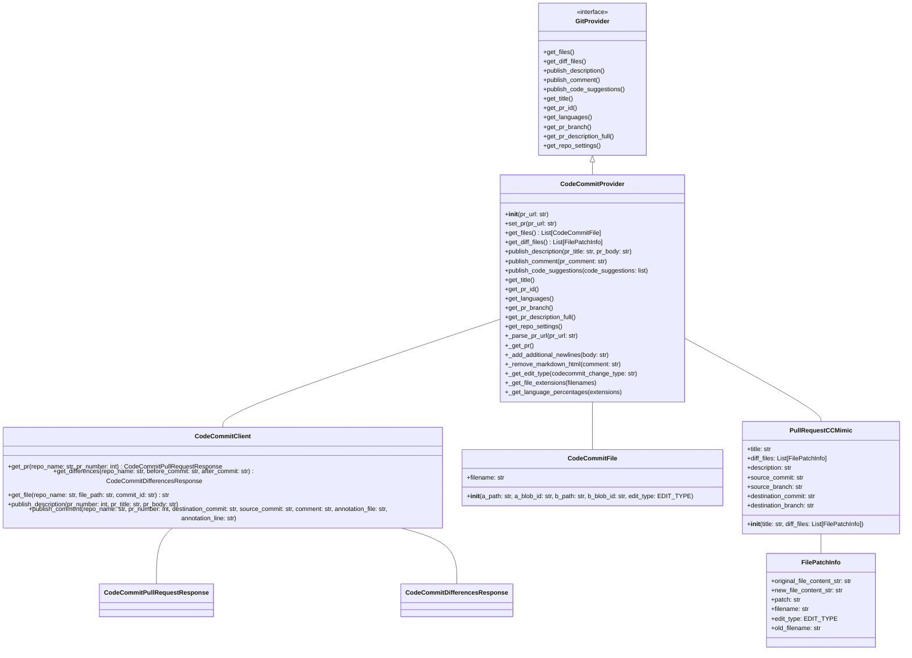
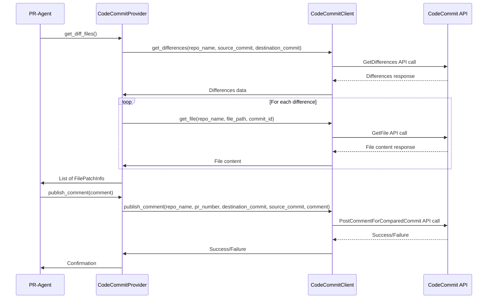
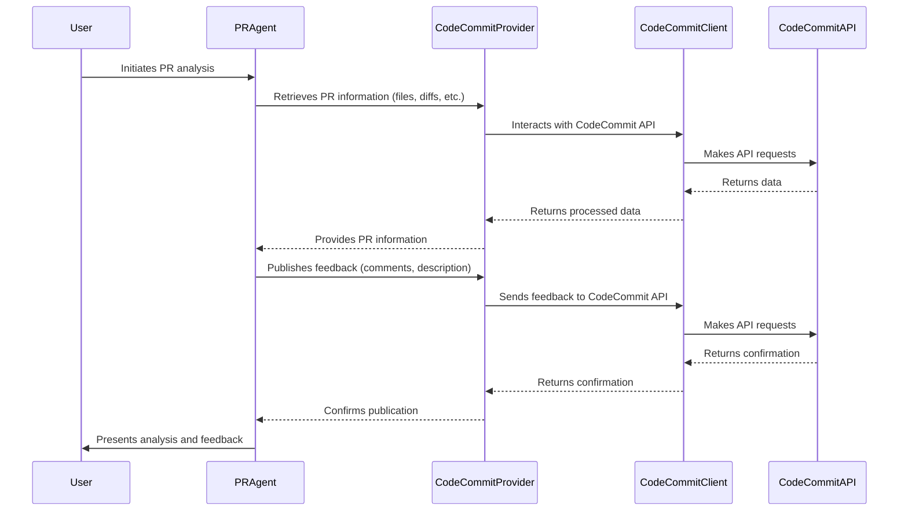

# CodeCommitProvider Detailed Documentation

## Introduction

This document provides a detailed overview of the `CodeCommitProvider` module, which is part of the `pr_agent` library. The `CodeCommitProvider` class is designed to interact with AWS CodeCommit repositories, implementing the `GitProvider` interface to provide a standardized way to access and manipulate pull request data. This documentation covers the module's purpose, architecture, core components, and how it integrates with other modules within the `pr_agent` system.

## Overview

The `CodeCommitProvider` module enables `pr_agent` to work with AWS CodeCommit repositories. It handles tasks such as fetching pull request details, retrieving file differences, publishing comments and descriptions, and extracting language statistics. The module uses the `CodeCommitClient` to interact with the AWS CodeCommit API.

## Architecture

The `CodeCommitProvider` module is structured as follows:

### Core Components

1.  **`CodeCommitProvider`**: This class implements the `GitProvider` interface and provides the main functionality for interacting with AWS CodeCommit. It handles tasks such as:
    *   Parsing the pull request URL.
    *   Fetching pull request details and file differences.
    *   Publishing comments and descriptions to the pull request.
    *   Retrieving language statistics for the pull request.

2.  **`CodeCommitFile`**: This class represents a file in a CodeCommit pull request. It stores information about the file's paths, blob IDs, and edit type (added, deleted, modified, or renamed).

3.  **`PullRequestCCMimic`**: This class mimics the `PullRequest` class from the PyGithub library. It is used to provide a consistent interface for accessing pull request data, regardless of the underlying Git provider.

### Relationships with Other Modules

*   **`GitProvider`**: `CodeCommitProvider` inherits from the `GitProvider` interface, ensuring that it provides a consistent set of methods for interacting with Git repositories. See [GitProvider Detailed Documentation.md](GitProvider Detailed Documentation.md) for more details.
*   **`CodeCommitClient`**: `CodeCommitProvider` uses `CodeCommitClient` to interact with the AWS CodeCommit API. This client handles the low-level details of making API requests and parsing responses. See [CodeCommitClient Detailed Documentation.md](CodeCommitClient Detailed Documentation.md) for more details.
*   **`FilePatchInfo`**: The `CodeCommitProvider` uses the `FilePatchInfo` class to store information about the changes in a file. This information is used by other modules to analyze the changes and generate suggestions.
*   **`EDIT_TYPE`**: The `CodeCommitProvider` uses the `EDIT_TYPE` enum to represent the type of change made to a file (added, deleted, modified, or renamed).
*   **`pr_agent.algo.language_handler`**: The `is_valid_file` function from this module is used to determine whether a file should be included in the list of diff files.
*   **`pr_agent.algo.utils`**: The `load_large_diff` function from this module is used to load the diff for a file.
*   **`pr_agent.config_loader`**: The `get_settings` function from this module is used to retrieve the language extension map.
*   **`pr_agent.log`**: The `get_logger` function from this module is used to log messages.

## Functionality

### Parsing the Pull Request URL

The `_parse_pr_url` method parses the CodeCommit pull request URL to extract the repository name and pull request number. It validates the URL format and ensures that the hostname is a valid CodeCommit hostname.

### Fetching Pull Request Details

The `_get_pr` method retrieves the pull request details from CodeCommit using the `CodeCommitClient`. It then creates a `PullRequestCCMimic` object to represent the pull request.

### Retrieving File Differences

The `get_files` method retrieves the list of files that have been modified in the pull request. The `get_diff_files` method retrieves the content and patch information for each modified file.

### Publishing Comments and Descriptions

The `publish_description` method publishes the pull request description to CodeCommit. The `publish_comment` method publishes a comment to the pull request. The `publish_code_suggestions` method publishes code suggestions as comments to specific lines in the pull request.

### Retrieving Language Statistics

The `get_languages` method calculates the percentage of each language used in the pull request. It uses the file extensions to identify the languages and the `language_extension_map` setting to map the extensions to language names.

## Data Flow

## Component Interaction

## Process Flows

### Retrieving File Differences

1.  The `PRAgent` calls the `get_diff_files` method of the `CodeCommitProvider`.
2.  The `CodeCommitProvider` calls the `get_differences` method of the `CodeCommitClient` to retrieve the list of differences in the pull request.
3.  For each difference, the `CodeCommitProvider` calls the `get_file` method of the `CodeCommitClient` to retrieve the content of the file before and after the change.
4.  The `CodeCommitProvider` creates a `FilePatchInfo` object for each file and adds it to the list of diff files.
5.  The `CodeCommitProvider` returns the list of diff files to the `PRAgent`.

### Publishing a Comment

1.  The `PRAgent` calls the `publish_comment` method of the `CodeCommitProvider`.
2.  The `CodeCommitProvider` calls the `publish_comment` method of the `CodeCommitClient` to publish the comment to CodeCommit.
3.  The `CodeCommitClient` makes a `PostCommentForComparedCommit` API call to CodeCommit.
4.  CodeCommit publishes the comment to the pull request.
5.  The `CodeCommitClient` returns a confirmation to the `CodeCommitProvider`.
6.  The `CodeCommitProvider` returns a confirmation to the `PRAgent`.

## Conclusion

The `CodeCommitProvider` module provides a crucial link between the `pr_agent` system and AWS CodeCommit repositories. By implementing the `GitProvider` interface and utilizing the `CodeCommitClient`, it offers a robust and standardized way to interact with CodeCommit pull requests. This documentation should provide a solid understanding of the module's architecture, functionality, and integration within the larger `pr_agent` ecosystem.
