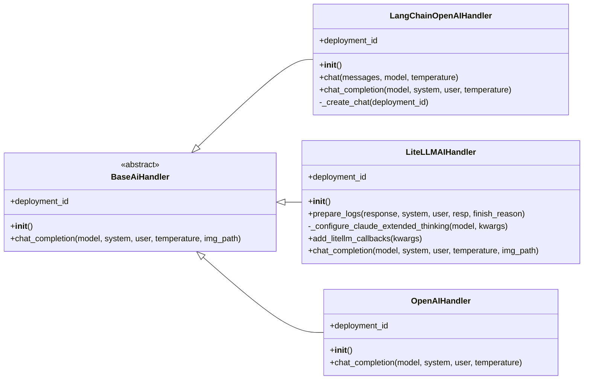

# AI Handlers Module Documentation

## Introduction

The `ai_handlers` module provides a standardized interface and various implementations for interacting with different Artificial Intelligence (AI) models. Its primary purpose is to abstract the complexities of various AI service providers, allowing the PR Agent to communicate with them uniformly. This module is crucial for enabling the PR Agent to leverage different AI capabilities for tasks such as code review, description generation, and more.

## Architecture Overview

The `ai_handlers` module is designed around a `BaseAiHandler` abstract base class, which defines the common interface for all AI interactions. Concrete implementations, such as `LangChainOpenAIHandler`, `LiteLLMAIHandler`, and `OpenAIHandler`, extend this base class to provide specific integrations with different AI platforms or libraries.

## High-Level Functionality

### `BaseAiHandler`

The `BaseAiHandler` is an abstract base class that defines the contract for all AI handlers. It ensures that any concrete AI handler implementation provides methods for initialization, retrieving a deployment ID, and performing chat completions.

### `LangChainOpenAIHandler`

This handler integrates with OpenAI models through the LangChain library. It supports both Azure OpenAI and standard OpenAI endpoints, handling message formatting and retries for API calls.

### `LiteLLMAIHandler`

The `LiteLLMAIHandler` provides a unified interface to a wide range of LLMs supported by the LiteLLM library. It handles various configurations for different providers (OpenAI, Anthropic, Cohere, Groq, Replicate, HuggingFace, Ollama, VertexAI, Google AI Studio, Deepseek, Deepinfra), manages system/user prompt combinations for specific models, and includes features like reasoning effort, Claude extended thinking, and LiteLLM callbacks.

### `OpenAIHandler`

This handler directly interacts with the OpenAI API. It manages API key configuration, organization settings, API version, and base URL. It provides a method for asynchronous chat completions with OpenAI models, including retry mechanisms for transient errors.

## Sub-module Documentation

*   [LangChain OpenAI Handler](langchain_ai_handler.md)
*   [LiteLLM AI Handler](litellm_ai_handler.md)
*   [OpenAI Handler](openai_ai_handler.md)
