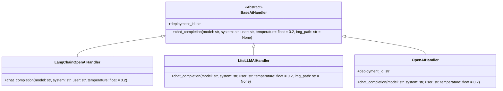

# AI Handlers Module

This module provides the core AI handler functionalities for the PR Agent, enabling it to interact with various language models. It defines an abstract base class and concrete implementations for different AI services.

## Architecture Overview

The `ai_handlers` module follows a strategy pattern, where different AI handlers implement a common interface (`BaseAiHandler`). This allows the PR Agent to switch between different AI providers (like OpenAI, Azure OpenAI, or LiteLLM-compatible services) without changing its core logic.

## Core Functionality

The module's primary goal is to abstract the complexities of interacting with AI models. It provides a unified interface for sending prompts and receiving completions, handling different API specifics, retries, and configurations.

### Sub-modules

*   [Base AI Handler](base_ai_handler.md)
*   [LangChain OpenAI Handler](langchain_ai_handler.md)
*   [LiteLLM AI Handler](litellm_ai_handler.md)
*   [OpenAI Handler](openai_ai_handler.md)
