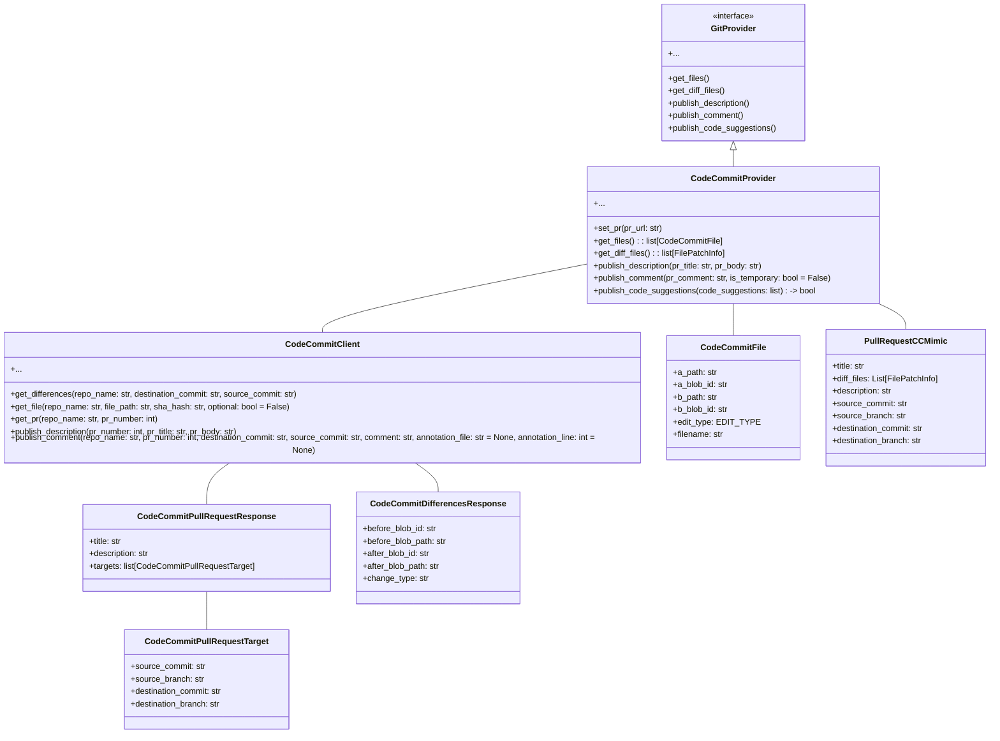

# CodeCommit Provider and Client Module Documentation

This module provides integration with AWS CodeCommit as a Git provider for the PR-Agent. It includes classes for interacting with CodeCommit repositories, handling pull requests, and managing file differences.

## Architecture

The module consists of two main parts:

1.  **CodeCommitProvider**: Implements the `GitProvider` interface to provide a consistent way to interact with CodeCommit repositories.
2.  **CodeCommitClient**: A client that uses the AWS boto3 SDK to interact with the AWS CodeCommit service.

## Functionality

### 1. CodeCommitProvider

This class is the main entry point for interacting with CodeCommit repositories. It implements the `GitProvider` interface (defined in [git_provider_base.md](git_provider_base.md)) and provides methods for:

*   Setting up the connection to a pull request using its URL.
*   Retrieving file information and diffs.
*   Publishing descriptions, comments, and code suggestions to a pull request.
*   Fetching the list of languages used in the pull request.

See [CodeCommitProvider Detailed Documentation](CodeCommitProvider Detailed Documentation.md) for more details.

### 2. CodeCommitClient

This class is a client for interacting with the AWS CodeCommit service using the boto3 SDK. It provides methods for:

*   Connecting to the AWS CodeCommit service.
*   Retrieving file differences between two commits.
*   Retrieving file content.
*   Retrieving pull request information.
*   Publishing descriptions and comments to a pull request.

See [CodeCommitClient Detailed Documentation](CodeCommitClient Detailed Documentation.md) for more details.
