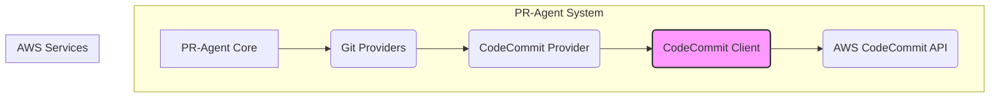
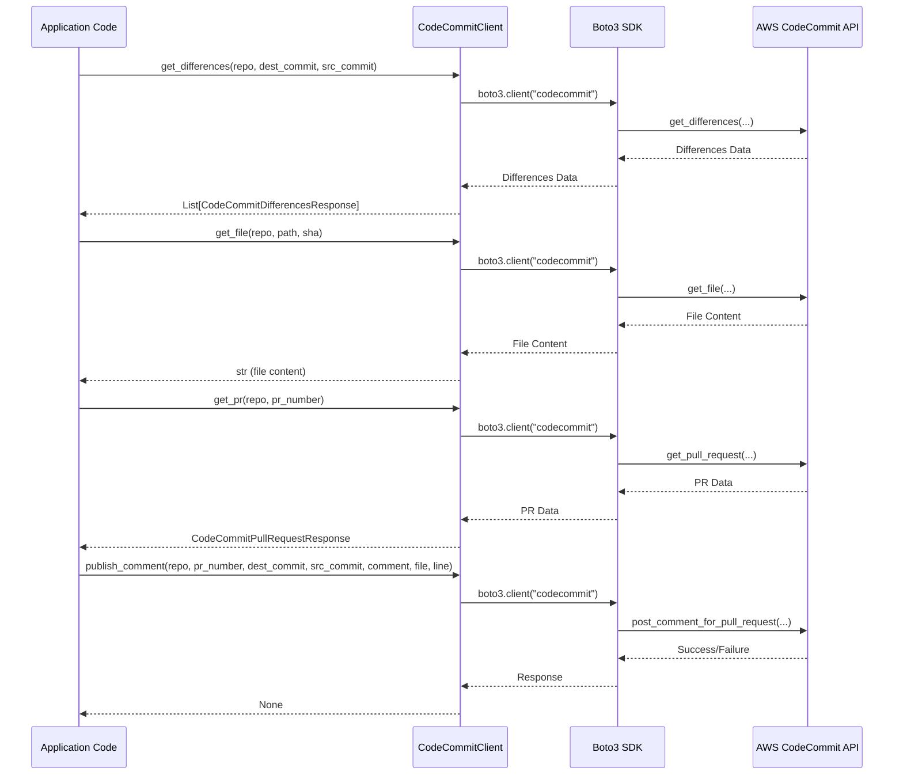

# CodeCommit Provider Components

This document provides an overview of the CodeCommit provider components, detailing their functionalities and how they integrate within the system.

## Core Components

The `codecommit_provider_components` module is responsible for interacting with AWS CodeCommit repositories. It provides a client for making API calls to CodeCommit and response objects for handling the data returned.

### CodeCommitClient

The `CodeCommitClient` class acts as a wrapper around the AWS boto3 SDK for the CodeCommit client. It facilitates various operations on CodeCommit repositories, such as retrieving differences between commits, fetching file contents, and managing pull requests.

**Capabilities:**
- `is_supported(capability: str)`: Checks if a given capability is supported. Currently, it returns `False` for "gfm_markdown".

**Key Methods:**
- `_connect_boto_client()`: Establishes a connection to the AWS CodeCommit service.
- `get_differences(repo_name: str, destination_commit: str, source_commit: str)`: Retrieves the differences between two specified commits in a repository. It handles pagination of results from the AWS API.
- `get_file(repo_name: str, file_path: str, sha_hash: str, optional: bool = False)`: Fetches the content of a specific file at a given commit hash. It can optionally handle cases where the file might not exist.
- `get_pr(repo_name: str, pr_number: int)`: Retrieves detailed information about a specific pull request, including its title, description, and target commits.
- `publish_description(pr_number: int, pr_title: str, pr_body: str)`: Updates the title and description of an existing pull request.
- `publish_comment(repo_name: str, pr_number: int, destination_commit: str, source_commit: str, comment: str, annotation_file: str = None, annotation_line: int = None)`: Posts a comment on a pull request. It supports annotating comments with file paths and line numbers.

**Boto3 Documentation References:**
- `get-differences`: https://boto3.amazonaws.com/v1/documentation/api/latest/reference/services/codecommit/client/get_differences.html
- `get-file`: https://boto3.amazonaws.com/v1/documentation/api/latest/reference/services/codecommit/client/get_file.html
- `get_pull_request`: https://boto3.amazonaws.com/v1/documentation/api/latest/reference/services/codecommit/client/get_pull_request.html
- `update_pull_request_title`: https://boto3.amazonaws.com/v1/documentation/api/latest/reference/services/codecommit/client/update_pull_request_title.html
- `update_pull_request_description`: https://boto3.amazonaws.com/v1/documentation/api/latest/reference/services/codecommit/client/update_pull_request_description.html
- `post_comment_for_pull_request`: https://boto3.amazonaws.com/v1/documentation/api/latest/reference/services/codecommit/client/post_comment_for_pull_request.html

### Response Objects

- **`CodeCommitDifferencesResponse`**: Represents the response from the `get_differences` method, mapping AWS CodeCommit difference details to accessible attributes like `before_blob_id`, `after_blob_path`, and `change_type`.

- **`CodeCommitPullRequestResponse`**: Represents the response from the `get_pr` method. It includes the pull request's `title`, `description`, and a list of `targets`.
    - **`CodeCommitPullRequestTarget`**: A nested class within `CodeCommitPullRequestResponse` that holds details for each target commit, including `source_commit`, `source_branch`, `destination_commit`, and `destination_branch`.

- **`CodeCommitPullRequestTarget`**: (See above, nested within `CodeCommitPullRequestResponse`)

- **`CodeCommitDifferencesResponse`**: (See above, represents differences between commits)

## Architecture and Integration

The `CodeCommitClient` is part of the `git_providers` module, which abstracts interactions with various Git hosting services. This allows the PR-Agent to work with different platforms like GitHub, GitLab, and CodeCommit through a unified interface.

### Dependencies

- **`boto3`**: The AWS SDK for Python, used for interacting with AWS services, including CodeCommit.
- **`botocore`**: The underlying dependency for `boto3`, used here for handling specific client errors.

### Data Flow

1.  **Requesting Differences**: When differences between commits are needed, `CodeCommitClient.get_differences` is called. It uses `boto3` to call the AWS CodeCommit API, paginates through the results, and returns a list of `CodeCommitDifferencesResponse` objects.
2.  **Fetching Files**: `CodeCommitClient.get_file` uses `boto3` to retrieve file content based on repository name, file path, and commit hash.
3.  **Retrieving PRs**: `CodeCommitClient.get_pr` fetches pull request details using the `get_pull_request` API call and structures the response using `CodeCommitPullRequestResponse`.
4.  **Updating PRs**: `publish_description` and `publish_comment` use `boto3` to update PR titles, descriptions, and post comments, respectively, with specific handling for CodeCommit's annotation system.

### Component Interaction

The `CodeCommitClient` interacts directly with the AWS CodeCommit service via the `boto3` SDK. It is designed to be used by higher-level components within the `git_providers` module, such as `CodeCommitProvider` (though not detailed in this specific component code), which would then expose a platform-agnostic interface to the rest of the PR-Agent.

## Usage Example (Conceptual)

```python
from pr_agent.git_providers.codecommit_provider import CodeCommitProvider # Assuming CodeCommitProvider uses CodeCommitClient internally

# Initialize the CodeCommitProvider (details may vary based on actual implementation)
codecommit_provider = CodeCommitProvider(repo_name="my-repo", ...)

# Get differences between two commits
differences = codecommit_provider.get_differences("commit_hash_1", "commit_hash_2")

# Get a specific pull request
pr_info = codecommit_provider.get_pr(pr_number=123)

# Post a comment on a PR
codecommit_provider.publish_comment(
    pr_number=123,
    destination_commit="main_commit_hash",
    source_commit="feature_commit_hash",
    comment="This is a great change!",
    annotation_file="src/main.py",
    annotation_line=42
)
```

## Mermaid Diagrams

### Architecture Diagram



### Component Interaction Diagram



### Data Flow: Retrieving Differences

```mermaid
graph TD
    A[Application] --> B(CodeCommitClient.get_differences);
    B --> C{Connect Boto Client};
    C -- If not connected --> D[Initialize Boto3 CodeCommit Client];
    D --> E(Call Boto3 get_differences);
    E --> F{AWS CodeCommit API};
    F -- Returns Differences --> E;
    E -- Processed Differences --> B;
    B -- Maps to --> G[List[CodeCommitDifferencesResponse]];
    G --> A;
```
