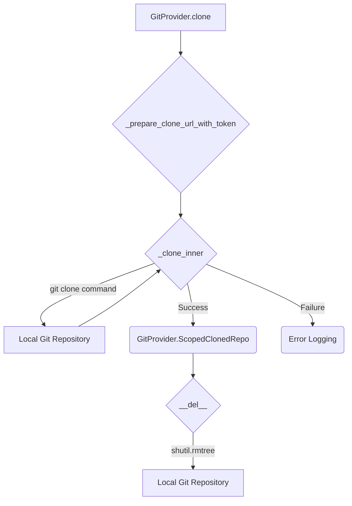

# Git Provider Core (`git_provider_core`)

This module defines the abstract base class `GitProvider` and related utility classes for interacting with various Git hosting services. It establishes a common interface for operations such as cloning repositories, retrieving file diffs, publishing comments, and managing labels.

## Core Components

### `GitProvider`

The abstract base class for all Git provider implementations. It defines the interface that concrete providers (e.g., GitHub, GitLab, Bitbucket) must implement.

#### Abstract Methods:

- `is_supported(capability: str) -> bool`: Checks if the provider supports a given capability.
- `get_files() -> list`: Retrieves a list of files in the repository.
- `get_diff_files() -> list[FilePatchInfo]`: Retrieves a list of changed files with their diff information.
- `publish_description(pr_title: str, pr_body: str)`: Publishes the PR title and body.
- `publish_code_suggestions(code_suggestions: list) -> bool`: Publishes code suggestions.
- `get_languages()`: Retrieves the programming languages used in the repository.
- `get_pr_branch()`: Gets the branch of the current PR/MR.
- `get_user_id()`: Gets the user ID of the current user.
- `get_pr_description_full() -> str`: Gets the full PR description.
- `publish_comment(pr_comment: str, is_temporary: bool = False)`: Publishes a comment on the PR/MR.
- `publish_inline_comment(body: str, relevant_file: str, relevant_line_in_file: str, original_suggestion=None)`: Publishes an inline comment on a specific line of a file.
- `publish_inline_comments(comments: list[dict])`: Publishes multiple inline comments.
- `remove_initial_comment()`: Removes the initial comment.
- `remove_comment(comment)`: Removes a specific comment.
- `get_issue_comments()`: Retrieves all comments on the PR/MR.
- `publish_labels(labels)`: Publishes labels for the PR/MR.
- `get_pr_labels(update=False)`: Retrieves the labels of the PR/MR.
- `add_eyes_reaction(issue_comment_id: int, disable_eyes: bool = False) -> Optional[int]`: Adds an "eyes" reaction to a comment.
- `remove_reaction(issue_comment_id: int, reaction_id: int) -> bool`: Removes a reaction from a comment.
- `get_commit_messages()`: Retrieves commit messages for the PR/MR.

#### Concrete Methods:

- `get_git_repo_url(issues_or_pr_url: str) -> str`: Attempts to get the Git repository URL from a given issue or PR URL. (Default implementation returns an empty string).
- `get_canonical_url_parts(repo_git_url: str, desired_branch: str) -> Tuple[str, str]`: Returns parts of the canonical URL for a given repository and branch. (Default implementation returns empty strings).
- `_prepare_clone_url_with_token(repo_url_to_clone: str) -> str | None`: Prepares the clone URL, potentially embedding tokens. (Default implementation returns None).
- `_clone_inner(repo_url: str, dest_folder: str, operation_timeout_in_seconds: int = None)`: Performs the actual Git clone operation with a timeout.
- `clone(repo_url_to_clone: str, dest_folder: str, remove_dest_folder: bool = True, operation_timeout_in_seconds: int = CLONE_TIMEOUT_SEC) -> ScopedClonedRepo | None`: Clones a repository to a destination folder. Returns a `ScopedClonedRepo` object that manages the lifecycle of the cloned repository.
- `get_pr_description(full: bool = True, split_changes_walkthrough=False) -> str or tuple`: Retrieves the PR description, with options to get the full description or split it into description and file changes. It also handles token limits.
- `get_user_description() -> str`: Extracts the user-provided description from the PR description, differentiating between user-written and agent-generated content.
- `_possible_headers()`: Returns a list of possible headers used by the PR agent in generated descriptions.
- `_is_generated_by_pr_agent(description_lowercase: str) -> bool`: Checks if a description was generated by the PR agent.
- `get_repo_settings()`: Retrieves repository-specific settings.
- `get_workspace_name()`: Returns the workspace name.
- `get_pr_id()`: Returns the PR ID.
- `get_line_link(relevant_file: str, relevant_line_start: int, relevant_line_end: int = None) -> str`: Generates a link to a specific line in a file.
- `get_lines_link_original_file(filepath: str, component_range: Range) -> str`: Generates a link to a range of lines in the original file.
- `publish_persistent_comment(...)`: Publishes a persistent comment, with logic to update existing comments if found.
- `publish_persistent_comment_full(...)`: A more comprehensive version of `publish_persistent_comment`.
- `create_inline_comment(body: str, relevant_file: str, relevant_line_in_file: str, absolute_position: int = None)`: Placeholder for creating inline comments (raises `NotImplementedError`).
- `get_comment_url(comment) -> str`: Returns the URL of a comment.
- `get_repo_labels()`: Retrieves all labels for the repository.
- `get_pr_url() -> str`: Returns the URL of the PR.
- `get_latest_commit_url() -> str`: Returns the URL of the latest commit.
- `auto_approve() -> bool`: Approves the PR automatically if supported.
- `calc_pr_statistics(pull_request_data: dict)`: Calculates PR statistics.
- `get_num_of_files()`: Gets the number of files changed in the PR.
- `limit_output_characters(output: str, max_chars: int)`: Limits the output string to a maximum number of characters.

### `ScopedClonedRepo`

A context manager-like class that wraps a cloned repository path. It ensures that the cloned repository directory is automatically removed when the object goes out of scope or is garbage collected, provided `remove_dest_folder` was set to `True` during cloning.

### `IncrementalPR`

A class to manage information related to incremental PR processing. It stores whether the PR is incremental, the commit range, and details about the first new commit and the last seen commit.

#### Properties:

- `first_new_commit_sha`: Returns the SHA of the first new commit, or `None`.
- `last_seen_commit_sha`: Returns the SHA of the last seen commit, or `None`.

## Dependencies

The `GitProvider` class depends on several other components:

- **`pr_agent.algo.types.FilePatchInfo`**: Used for representing file changes.
- **`pr_agent.algo.utils`**: Utilized for utility functions like `Range`, `process_description`, and `clip_tokens`.
- **`pr_agent.config_loader.get_settings`**: Used to access configuration settings, such as `MAX_DESCRIPTION_TOKENS` and `language_extension_map_org`.
- **`pr_agent.log.get_logger`**: For logging information and errors.

## Architecture and Component Interaction

The `GitProvider` acts as an abstraction layer. Concrete implementations (e.g., `GithubProvider`, `GitLabProvider`) translate the generic operations defined in `GitProvider` into specific API calls for their respective platforms.

**Diagram: Component Interaction**

```mermaid
graph TD
    A[External System/User] --> B(PR Agent Core);
    B --> C{GitProvider Interface};
    C --> D[Concrete Git Provider (e.g., GithubProvider)];
    D --> E[Git Hosting API (e.g., GitHub API)];
    E --> D;
    D --> C;
    C --> B;
    B --> A;

    subgraph GitProvider Module
        C
        C -- Implements --> D
        C -- Uses --> F(pr_agent.algo.types.FilePatchInfo)
        C -- Uses --> G(pr_agent.algo.utils)
        C -- Uses --> H(pr_agent.config_loader)
        C -- Uses --> I(pr_agent.log)
    end
```

**Diagram: Cloning Process**



## Usage

The `GitProvider` interface is intended to be implemented by specific Git hosting service providers. The PR Agent core would then use an instance of the appropriate concrete provider to interact with the Git repository.

For example, to clone a repository:

```python
# Assuming 'github_provider' is an instance of GithubProvider
repo_url = "https://github.com/user/repo.git"
dest_path = "/tmp/my_repo"
with TemporaryDirectory() as tmp_dir: # Using a temporary directory for demonstration
    scoped_repo = github_provider.clone(repo_url, tmp_dir)
    if scoped_repo:
        print(f"Repository cloned to: {scoped_repo.path}")
        # Use the repository at scoped_repo.path
    # scoped_repo is automatically cleaned up here
```

## Related Modules

- **`pr_agent.git_providers.github_provider`**: Implementation for GitHub.
- **`pr_agent.git_providers.gitlab_provider`**: Implementation for GitLab.
- **`pr_agent.git_providers.azuredevops_provider`**: Implementation for Azure DevOps.
- **`pr_agent.git_providers.bitbucket_provider`**: Implementation for Bitbucket.
- **`pr_agent.git_providers.bitbucket_server_provider`**: Implementation for Bitbucket Server.
- **`pr_agent.git_providers.gerrit_provider`**: Implementation for Gerrit.
- **`pr_agent.git_providers.vnpt_scm_provider`**: Implementation for VNPT SCM.
- **`pr_agent.git_providers.codecommit_provider`**: Implementation for AWS CodeCommit.
- **`pr_agent.git_providers.local_git_provider`**: Implementation for local Git repositories.
