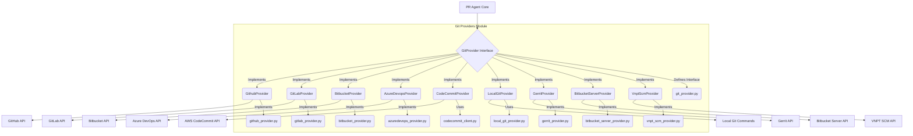

# Git Providers Module

## Purpose

The `git_providers` module serves as an abstraction layer for interacting with various Git hosting services. It defines a common interface (`GitProvider`) that concrete implementations for platforms like GitHub, GitLab, Bitbucket, Azure DevOps, and AWS CodeCommit adhere to. This allows the PR-Agent to perform Git-related operations (e.g., cloning repositories, fetching diffs, publishing comments) in a platform-agnostic manner.

## Architecture

The module is structured around the `GitProvider` abstract base class, which outlines the core functionalities. Each supported Git hosting service has a corresponding concrete implementation (e.g., `GithubProvider`, `GitLabProvider`). Helper classes and specific client implementations (like `CodeCommitClient`) are used to interact with the respective platform APIs.

## Core Components Documentation

### `pr_agent.git_providers.git_provider.GitProvider`

The abstract base class for all Git provider implementations. It defines the common interface for interacting with Git repositories and pull requests across different platforms.

**Key Methods:**

*   `is_supported(capability: str) -> bool`: Checks if the provider supports a given capability.
*   `get_files() -> list`: Retrieves a list of files in the repository.
*   `get_diff_files() -> list[FilePatchInfo]`: Retrieves a list of changed files with their diff information.
*   `publish_description(pr_title: str, pr_body: str)`: Publishes the PR title and body.
*   `publish_code_suggestions(code_suggestions: list) -> bool`: Publishes code suggestions.
*   `get_languages()`: Retrieves the programming languages used in the repository.
*   `get_pr_branch()`: Gets the branch of the current PR/MR.
*   `get_user_id()`: Gets the user ID of the current user.
*   `get_pr_description_full() -> str`: Gets the full PR description.
*   `publish_comment(pr_comment: str, is_temporary: bool = False)`: Publishes a comment on the PR/MR.
*   `publish_inline_comment(body: str, relevant_file: str, relevant_line_in_file: str, original_suggestion=None)`: Publishes an inline comment on a specific line of a file.
*   `publish_inline_comments(comments: list[dict])`: Publishes multiple inline comments.
*   `remove_initial_comment()`: Removes the initial comment.
*   `remove_comment(comment)`: Removes a specific comment.
*   `get_issue_comments()`: Retrieves all comments on the PR/MR.
*   `publish_labels(labels)`: Publishes labels for the PR/MR.
*   `get_pr_labels(update=False)`: Retrieves the labels of the PR/MR.
*   `add_eyes_reaction(issue_comment_id: int, disable_eyes: bool = False) -> Optional[int]`: Adds an "eyes" reaction to a comment.
*   `remove_reaction(issue_comment_id: int, reaction_id: int) -> bool`: Removes a reaction from a comment.
*   `get_commit_messages()`: Retrieves commit messages for the PR/MR.
*   `clone(repo_url_to_clone: str, dest_folder: str, remove_dest_folder: bool = True, operation_timeout_in_seconds: int = CLONE_TIMEOUT_SEC) -> ScopedClonedRepo | None`: Clones a repository to a destination folder.

**References:**
*   [Git Provider Core Documentation](https://github.com/carl-ai/pr-agent/blob/main/pr_agent/git_providers/git_provider_core/docs.md) (Note: This is a hypothetical link based on the provided structure, actual documentation might be elsewhere)

### `pr_agent.git_providers.github_provider.GithubProvider`

Implementation for interacting with GitHub repositories and pull requests.

**References:**
*   [Git Provider Core Documentation](https://github.com/carl-ai/pr-agent/blob/main/pr_agent/git_providers/git_provider_core/docs.md)

### `pr_agent.git_providers.gitlab_provider.GitLabProvider`

Implementation for interacting with GitLab repositories and merge requests.

**References:**
*   [Git Provider Core Documentation](https://github.com/carl-ai/pr-agent/blob/main/pr_agent/git_providers/git_provider_core/docs.md)

### `pr_agent.git_providers.azuredevops_provider.AzureDevopsProvider`

Implementation for interacting with Azure DevOps repositories and pull requests.

**References:**
*   [Git Provider Core Documentation](https://github.com/carl-ai/pr-agent/blob/main/pr_agent/git_providers/git_provider_core/docs.md)

### `pr_agent.git_providers.bitbucket_provider.BitbucketProvider`

Implementation for interacting with Bitbucket Cloud repositories and pull requests.

**References:**
*   [Git Provider Core Documentation](https://github.com/carl-ai/pr-agent/blob/main/pr_agent/git_providers/git_provider_core/docs.md)

### `pr_agent.git_providers.bitbucket_server_provider.BitbucketServerProvider`

Implementation for interacting with Bitbucket Server repositories and pull requests.

**References:**
*   [Git Provider Core Documentation](https://github.com/carl-ai/pr-agent/blob/main/pr_agent/git_providers/git_provider_core/docs.md)

### `pr_agent.git_providers.gerrit_provider.GerritProvider`

Implementation for interacting with Gerrit repositories and changes.

**References:**
*   [Git Provider Core Documentation](https://github.com/carl-ai/pr-agent/blob/main/pr_agent/git_providers/git_provider_core/docs.md)

### `pr_agent.git_providers.vnpt_scm_provider.VnptScmProvider`

Implementation for interacting with VNPT SCM repositories.

**References:**
*   [Git Provider Core Documentation](https://github.com/carl-ai/pr-agent/blob/main/pr_agent/git_providers/git_provider_core/docs.md)

### `pr_agent.git_providers.codecommit_provider.CodeCommitProvider`

Implementation for interacting with AWS CodeCommit repositories. It utilizes `CodeCommitClient` for direct API interactions.

**References:**
*   [CodeCommit Provider Components Documentation](https://github.com/carl-ai/pr-agent/blob/main/pr_agent/git_providers/codecommit_provider_components/docs.md) (Note: This is a hypothetical link)
*   [Git Provider Core Documentation](https://github.com/carl-ai/pr-agent/blob/main/pr_agent/git_providers/git_provider_core/docs.md)

### `pr_agent.git_providers.local_git_provider.LocalGitProvider`

Implementation for interacting with local Git repositories. It simulates pull request operations using local files and Git commands.

**References:**
*   [Local Git Provider Documentation](https://github.com/carl-ai/pr-agent/blob/main/pr_agent/git_providers/local_git_provider/docs.md)
*   [Git Provider Core Documentation](https://github.com/carl-ai/pr-agent/blob/main/pr_agent/git_providers/git_provider_core/docs.md)

### `pr_agent.git_providers.codecommit_client.CodeCommitClient`

A client class that wraps the AWS boto3 SDK for interacting with AWS CodeCommit.

**References:**
*   [CodeCommit Provider Components Documentation](https://github.com/carl-ai/pr-agent/blob/main/pr_agent/git_providers/codecommit_provider_components/docs.md) (Note: This is a hypothetical link)

### `pr_agent.git_providers.git_provider.ScopedClonedRepo`

A helper class that manages the lifecycle of a cloned repository, ensuring its cleanup.

**References:**
*   [Git Provider Core Documentation](https://github.com/carl-ai/pr-agent/blob/main/pr_agent/git_providers/git_provider_core/docs.md)

### `pr_agent.git_providers.git_provider.IncrementalPR`

A class to manage information related to incremental PR processing.

**References:**
*   [Git Provider Core Documentation](https://github.com/carl-ai/pr-agent/blob/main/pr_agent/git_providers/git_provider_core/docs.md)