## `git_providers` Module Overview

The `git_providers` module provides an abstraction layer for interacting with various Git providers (e.g., GitHub, GitLab, Azure DevOps, Bitbucket, CodeCommit). It defines a common interface (`GitProvider`) for fetching pull request data, publishing comments, and handling code suggestions, allowing the PR-Agent to work seamlessly across different platforms.

### Architecture

The module's architecture revolves around the `GitProvider` interface, which is implemented by specific provider classes. This allows for a consistent way to interact with different Git platforms.

```mermaid
classDiagram
    class GitProvider {
        <<interface>>
        +get_files()
        +get_diff_files()
        +publish_description()
        +publish_comment()
        +publish_code_suggestions()
        +...
    }
    GitProvider <|-- GithubProvider
    GitProvider <|-- GitLabProvider
    GitProvider <|-- AzureDevopsProvider
    GitProvider <|-- BitbucketProvider
    GitProvider <|-- BitbucketServerProvider
    GitProvider <|-- GerritProvider
    GitProvider <|-- CodeCommitProvider
    GitProvider <|-- LocalGitProvider
    GitProvider <|-- VnptScmProvider
    class GithubProvider {
        +set_pr(pr_url: str)
        +get_files()
        +get_diff_files()
        +publish_description(pr_title: str, pr_body: str)
        +publish_comment(pr_comment: str, is_temporary: bool = False)
        +publish_code_suggestions(code_suggestions: list) -> bool
        +...
    }
    class GitLabProvider {
        +set_pr(pr_url: str)
        +get_files()
        +get_diff_files()
        +publish_description(pr_title: str, pr_body: str)
        +publish_comment(pr_comment: str, is_temporary: bool = False)
        +publish_code_suggestions(code_suggestions: list) -> bool
        +...
    }
    class AzureDevopsProvider {
        +set_pr(pr_url: str)
        +get_files()
        +get_diff_files()
        +publish_description(pr_title: str, pr_body: str)
        +publish_comment(pr_comment: str, is_temporary: bool = False)
        +publish_code_suggestions(code_suggestions: list) -> bool
        +...
    }
    class BitbucketProvider {
        +set_pr(pr_url: str)
        +get_files()
        +get_diff_files()
        +publish_description(pr_title: str, pr_body: str)
        +publish_comment(pr_comment: str, is_temporary: bool = False)
        +publish_code_suggestions(code_suggestions: list) -> bool
        +...
    }
    class BitbucketServerProvider {
        +set_pr(pr_url: str)
        +get_files()
        +get_diff_files()
        +publish_description(pr_title: str, pr_body: str)
        +publish_comment(pr_comment: str, is_temporary: bool = False)
        +publish_code_suggestions(code_suggestions: list) -> bool
        +...
    }
   class GerritProvider {
        +set_pr(pr_url: str)
        +get_files()
        +get_diff_files()
        +publish_description(pr_title: str, pr_body: str)
        +publish_comment(pr_comment: str, is_temporary: bool = False)
        +publish_code_suggestions(code_suggestions: list) -> bool
        +...
    }
    class CodeCommitProvider {
        +set_pr(pr_url: str)
        +get_files()
        +get_diff_files()
        +publish_description(pr_title: str, pr_body: str)
        +publish_comment(pr_comment: str, is_temporary: bool = False)
        +publish_code_suggestions(code_suggestions: list) -> bool
        +...
    }
    class LocalGitProvider {
        +set_pr(pr_url: str)
        +get_files()
        +get_diff_files()
        +publish_description(pr_title: str, pr_body: str)
        +publish_comment(pr_comment: str, is_temporary: bool = False)
        +publish_code_suggestions(code_suggestions: list) -> bool
        +...
    }
    class VnptScmProvider {
        +set_pr(pr_url: str)
        +get_files()
        +get_diff_files()
        +publish_description(pr_title: str, pr_body: str)
        +publish_comment(pr_comment: str, is_temporary: bool = False)
        +publish_code_suggestions(code_suggestions: list) -> bool
        +...
    }
```

### Core Components

*   **`GitProvider`**: An abstract base class defining the interface for interacting with Git providers. It includes methods for fetching files, diffs, and publishing comments/descriptions. See [git_provider_base.md](git_providers/git_provider_base/git_provider_base.md) for more details.
*   **`ScopedClonedRepo`**: A context manager that clones a Git repository into a temporary directory and cleans it up after use.
*   **`IncrementalPR`**: A class to represent a pull request with incremental changes.
*   **`GithubProvider`**: Implementation of `GitProvider` for GitHub. See [github_provider.md](git_providers/github_provider/github_provider.md) for more details.
*   **`GitLabProvider`**: Implementation of `GitProvider` for GitLab. See [gitlab_provider.md](git_providers/gitlab_provider/gitlab_provider.md) for more details.
*   **`AzureDevopsProvider`**: Implementation of `GitProvider` for Azure DevOps. See [azuredevops_provider.md](git_providers/azuredevops_provider/azuredevops_provider.md) for more details.
*   **`BitbucketProvider`**: Implementation of `GitProvider` for Bitbucket. See [bitbucket_provider.md](git_providers/bitbucket_provider/bitbucket_provider.md) for more details.
*   **`BitbucketServerProvider`**: Implementation of `GitProvider` for Bitbucket Server. See [bitbucket_server_provider.md](git_providers/bitbucket_server_provider/bitbucket_server_provider.md) for more details.
*   **`GerritProvider`**: Implementation of `GitProvider` for Gerrit. See [gerrit_provider.md](git_providers/gerrit_provider/gerrit_provider.md) for more details.
*   **`CodeCommitProvider`**: Implementation of `GitProvider` for AWS CodeCommit. See [codecommit_provider_and_client.md](git_providers/codecommit_provider_and_client/codecommit_provider_and_client.md) for more details.
*   **`LocalGitProvider`**: Implementation of `GitProvider` for local Git repositories. See [local_git_provider.md](git_providers/local_git_provider/local_git_provider.md) for more details.
*   **`VnptScmProvider`**: Implementation of `GitProvider` for VNPT SCM. See [vnpt_scm_provider.md](git_providers/vnpt_scm_provider/vnpt_scm_provider.md) for more details.

### Relationships to Other Modules

The `git_providers` module is primarily used by the `core_agent` module (`pr_agent.agent.pr_agent.PRAgent`) to interact with Git repositories.  It utilizes the `utilities_and_types` module (`pr_agent/algo`) for data types like `FilePatchInfo` and `EDIT_TYPE`.