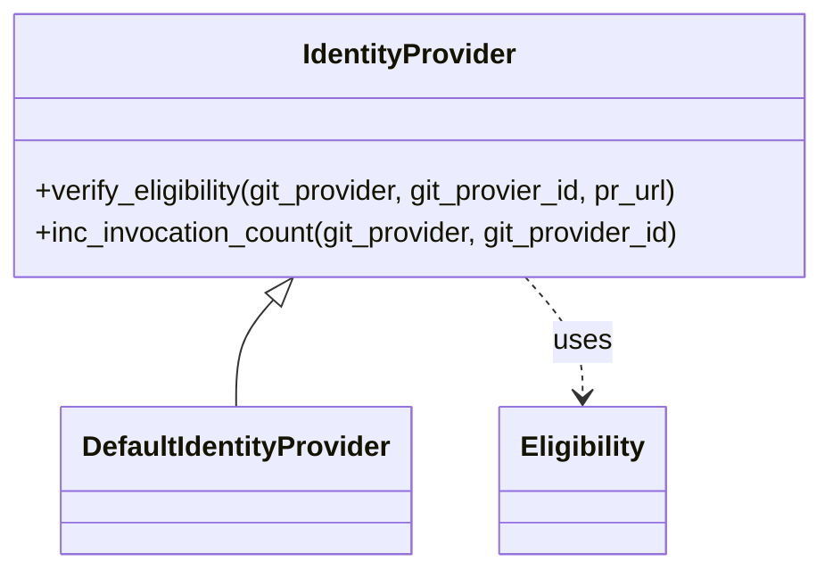

# Identity Providers Module

This module provides an abstraction for managing and verifying the eligibility of users or systems interacting with the PR-Agent.

## Architecture Overview

The identity providers module consists of an abstract base class `IdentityProvider` and a concrete implementation `DefaultIdentityProvider`. This structure allows for future extensions with different identity verification mechanisms.

## Core Components

### IdentityProvider

This is an abstract base class that defines the interface for all identity providers. It specifies methods for verifying user eligibility and tracking invocation counts.

### DefaultIdentityProvider

This is a concrete implementation of the `IdentityProvider` interface. It provides a default behavior for verifying eligibility, currently always returning `ELIGIBLE` and does not track invocation counts.

### Eligibility Enum

An enumeration representing the different eligibility statuses a user or system can have: `NOT_ELIGIBLE`, `ELIGIBLE`, and `TRIAL`.

## Related Modules

*   [AI Handlers](ai_handlers.md)
*   [Git Providers](git_providers.md)
*   [Secret Providers](secret_providers.md)
