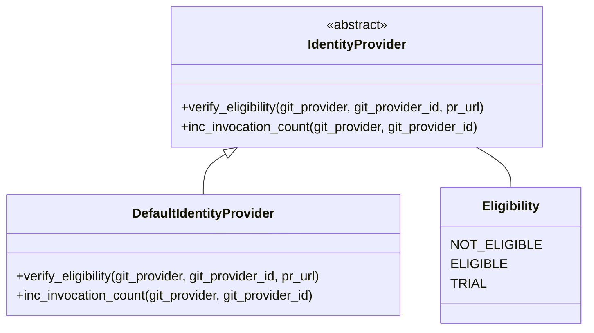

# Identity Providers Module Documentation

## Introduction

The `identity_providers` module is responsible for determining the eligibility of a Git provider to use the PR-Agent tool. It provides an abstraction layer for different identity verification methods, allowing the system to control access and track usage. Currently, only a default implementation is provided, which always returns that a Git provider is eligible.

## Architecture

The module consists of the following core components:

- `IdentityProvider`: An abstract base class that defines the interface for identity providers.
- `Eligibility`: An enumeration that represents the possible eligibility states.
- `DefaultIdentityProvider`: A concrete implementation of `IdentityProvider` that always returns `ELIGIBLE`.

## Functionality

The `identity_providers` module provides the following functionality:

- **Eligibility Verification:** Determines whether a given Git provider is eligible to use the PR-Agent tool.
- **Invocation Counting:** Tracks the number of times the PR-Agent tool is invoked for a given Git provider.

### Sub-modules

Currently, the module only contains a default implementation. Future implementations may include more sophisticated identity verification methods.

- **DefaultIdentityProvider:** This sub-module provides a default implementation of the `IdentityProvider` interface. It always returns `ELIGIBLE` for any Git provider. See [DefaultIdentityProvider Documentation](default_identity_provider.md) for more details.

## Integration with Other Modules

The `identity_providers` module is used by the core agent to verify the eligibility of a Git provider before processing a pull request. It interacts with the `git_providers` module to obtain information about the Git provider and the pull request.
