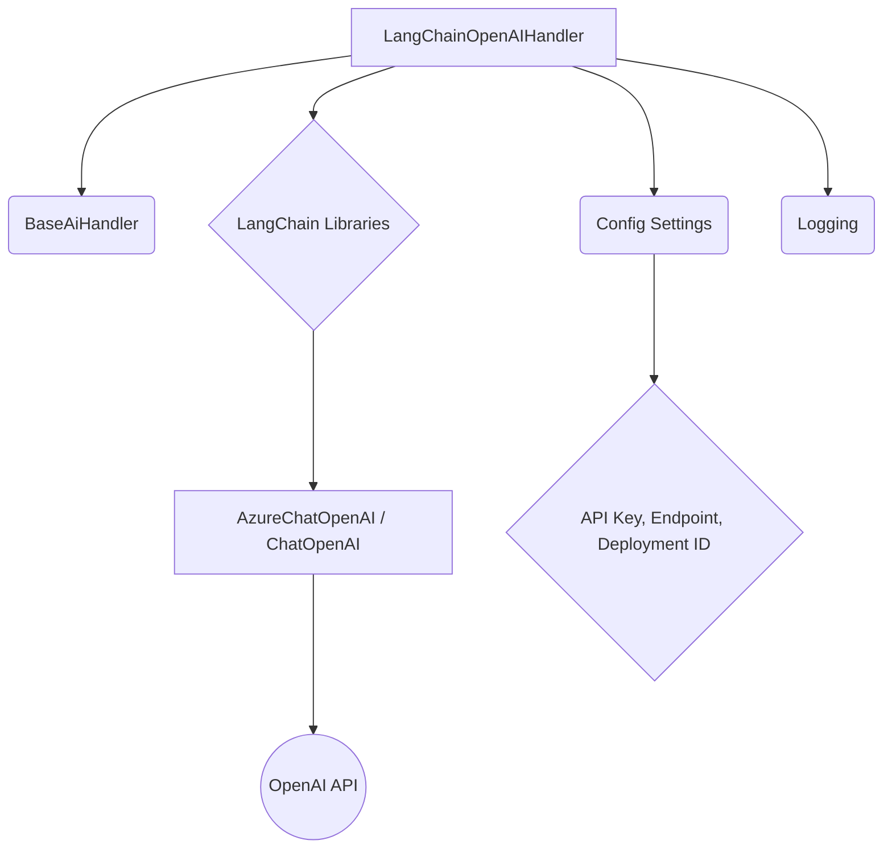

# Documentation for langchain_ai_handler module

## Overview

The `langchain_ai_handler` module provides functionalities for interacting with AI models, specifically leveraging the LangChain library for OpenAI and Azure OpenAI services. It acts as a handler for AI-driven tasks within the PR-Agent system, abstracting the complexities of direct API calls and model interactions.

## Core Components

### LangChainOpenAIHandler

- **Description:** This class is the primary component for handling AI interactions using LangChain. It supports both standard OpenAI and Azure OpenAI endpoints.
- **Inheritance:** Inherits from `BaseAiHandler`.
- **Key Features:**
    - Initializes with settings for OpenAI or Azure OpenAI.
    - Provides a `chat` method for invoking chat models with messages, model name, and temperature.
    - Implements `chat_completion` for asynchronous chat completions, including retry logic for API errors.
    - Handles model deployment IDs for Azure OpenAI.
    - Abstracts API key, version, and endpoint configurations.

## Architecture and Dependencies

The `LangChainOpenAIHandler` depends on the following:

- **`pr_agent.algo.ai_handlers.base_ai_handler.BaseAiHandler`:** Provides the base interface and common functionalities for AI handlers.
- **`langchain_core.messages`:** Used for structuring messages (e.g., `HumanMessage`, `SystemMessage`).
- **`langchain_openai`:** Specifically `AzureChatOpenAI` and `ChatOpenAI` for interacting with OpenAI models.
- **`openai`:** For handling specific OpenAI API exceptions like `APIError`, `RateLimitError`, and `Timeout`.
- **`retry`:** A library used for implementing retry mechanisms for API calls.
- **`pr_agent.config_loader.get_settings`:** Used to load configuration settings, including API keys, endpoints, and deployment IDs.
- **`pr_agent.log.get_logger`:** For logging information and errors.

## Data Flow

1.  **Initialization:** When `LangChainOpenAIHandler` is initialized, it reads settings from `get_settings()` to determine if it should use Azure OpenAI and creates an initial chat object for validation.
2.  **Chat Completion Request:** A request to `chat_completion` involves:
    *   Constructing a list of `SystemMessage` and `HumanMessage` objects.
    *   Calling the `chat` method with these messages, the specified model, and temperature.
    *   The `chat` method internally uses `AzureChatOpenAI` or `ChatOpenAI` to invoke the model.
    *   The response from the model is processed.
3.  **Error Handling:** The `chat_completion` method is decorated with `@retry` to automatically retry API calls in case of `APIError`, `Timeout`, or `RateLimitError`.

## Component Interaction

The `LangChainOpenAIHandler` interacts with external services (OpenAI API) and internal modules (`BaseAiHandler`, configuration, logging).



## Usage Example

```python
# Assuming settings are configured and LangChainOpenAIHandler is instantiated
handler = LangChainOpenAIHandler()
system_prompt = "You are a helpful assistant."
user_prompt = "What is the capital of France?"

try:
    response, finish_reason = await handler.chat_completion(
        model="gpt-4",
        system=system_prompt,
        user=user_prompt,
        temperature=0.7
    )
    print(f"Response: {response}")
    print(f"Finish Reason: {finish_reason}")
except Exception as e:
    print(f"An error occurred: {e}")

```

## Relationship to Other Modules

- **`pr_agent.algo.ai_handlers.base_ai_handler`:** `LangChainOpenAIHandler` extends this module, inheriting its base functionalities.
- **`pr_agent.config_loader`:** Crucial for retrieving API credentials and model configurations.
- **`pr_agent.log`:** Used for reporting errors and operational information.
- **`langchain_openai` and `langchain_core`:** These external libraries are fundamental to the handler's operation.

## Future Considerations

- **Model Fallbacks:** Explore implementing more robust fallback mechanisms for different model deployments.
- **Advanced Configuration:** Allow more granular control over LangChain-specific parameters.
