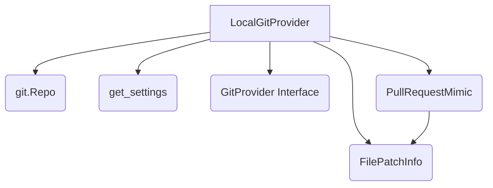

# Documentation for local_git_provider Module

## Overview

The `local_git_provider` module provides an implementation of the `GitProvider` interface for local Git repositories. It allows the PR-Agent to interact with local branches as if they were pull requests, enabling functionalities like code review and description generation without requiring a remote repository.

## Core Components

### `LocalGitProvider`

The `LocalGitProvider` class is the main component of this module. It extends the `GitProvider` abstract class and provides a local, file-system-based implementation for Git operations relevant to pull requests.

**Key Features:**

*   **Local Repository Interaction:** Operates directly on a local Git repository, finding the repository root and using `git.Repo` for operations.
*   **PR Mimicry:** Simulates pull request objects and functionalities using the `PullRequestMimic` class.
*   **Diff Generation:** Calculates and provides file differences between the current branch and a specified target branch.
*   **File Operations:** Supports reading and writing PR descriptions and reviews to local files (`description.md` and `review.md` by default).
*   **Limited Capability Support:** Primarily supports `/review` and `/describe` commands. Features like inline comments, labels, and issue comments are not supported and will raise `NotImplementedError`.
*   **Repository State Check:** Ensures the repository is in a clean state (no uncommitted changes) before proceeding.

**Usage:**

```python
from pr_agent.git_providers.local_git_provider import LocalGitProvider

# Assuming you are in a git repository and 'main' is the target branch
provider = LocalGitProvider(target_branch_name='main')

# Get changed files
diff_files = provider.get_diff_files()

# Publish a review to a local file
provider.publish_comment("This is a review comment.")

# Publish a description to a local file
provider.publish_description("PR Title", "PR Body")
```

### `PullRequestMimic`

A helper class that mimics the structure of a pull request object, specifically designed to be used by `LocalGitProvider`. It holds the PR title and a list of changed files (`FilePatchInfo`).

## Architecture and Dependencies

The `LocalGitProvider` depends on the following:

*   **`git.Repo`:** For interacting with the local Git repository.
*   **`pr_agent.algo.types.FilePatchInfo`:** To represent file changes.
*   **`pr_agent.config_loader.get_settings`:** To load configuration settings, such as the paths for description and review files.
*   **`pr_agent.git_providers.git_provider.GitProvider`:** Implements the abstract base class for Git providers.

### Diagram: Component Interaction



## Data Flow

1.  **Initialization:** `LocalGitProvider` is initialized with a target branch name. It finds the repository root, initializes `git.Repo`, and checks the repository's state.
2.  **Diff Calculation:** `get_diff_files()` uses `repo.head.commit.diff()` to compute the differences between the current HEAD and the target branch. Each difference is converted into a `FilePatchInfo` object.
3.  **Publishing:**
    *   `publish_description()` writes the PR title and body to `description.md`.
    *   `publish_comment()` writes the review comment to `review.md`.
4.  **Unsupported Operations:** Calls to methods not supported by the local provider (e.g., `publish_inline_comment`) raise `NotImplementedError`.

## Module Integration

The `LocalGitProvider` integrates into the PR-Agent system by fulfilling the `GitProvider` interface. This allows the agent to use a local repository for testing and development workflows, abstracting away the complexities of remote repository interactions. It is particularly useful for:

*   Testing PR-Agent features locally.
*   Generating PR descriptions and reviews for local branches.
*   Developing and debugging without pushing to a remote.

## Limitations

*   **No Remote Operations:** Cannot interact with remote repositories (e.g., push, pull, create remote PRs).
*   **Limited Capabilities:** Does not support features that require remote API access, such as inline comments, labels, issue comments, or GFM markdown rendering.
*   **File Output:** Outputs descriptions and reviews to local files instead of directly to a PR.
*   **Branch Management:** Assumes the target branch exists and the repository is clean.

## Future Enhancements

*   Support for more Git operations relevant to local development.
*   Improved handling of merge bases for more accurate diffs.
*   Configuration options for output file paths.
```
