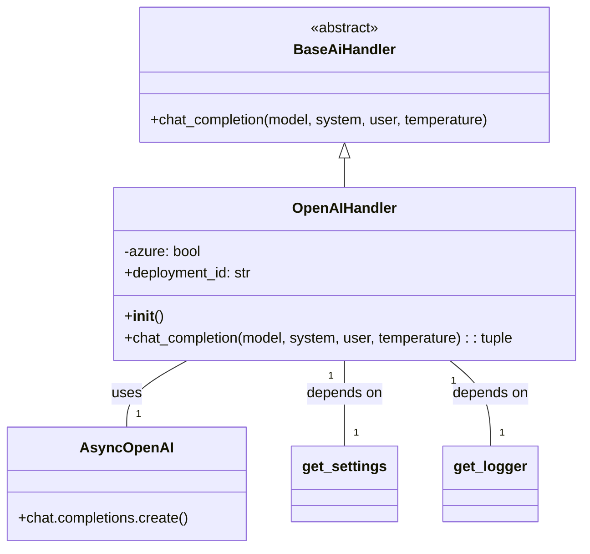
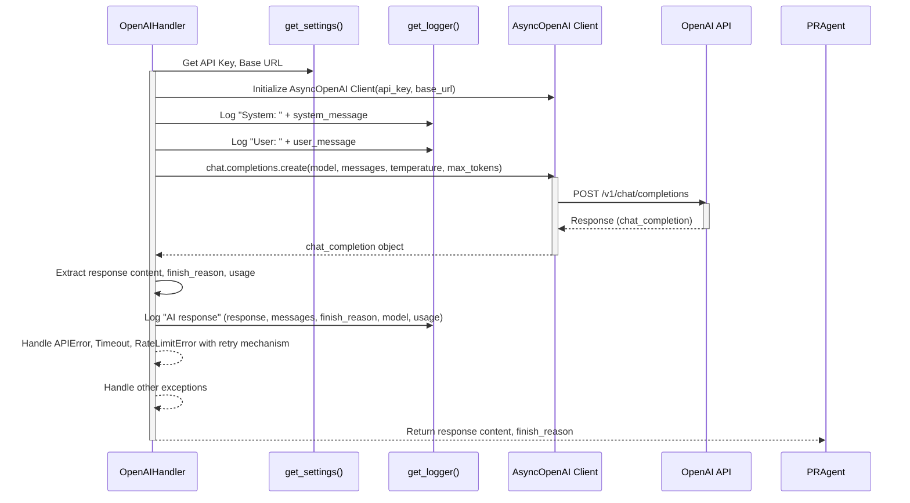

# OpenAI AI Handler Module

## Introduction
The `openai_ai_handler` module provides a concrete implementation for interacting with OpenAI's API, specifically for chat completion tasks. It extends the `BaseAiHandler` to offer a standardized interface for AI model interactions while encapsulating the specifics of OpenAI API calls, including authentication, retry mechanisms, and error handling.

## Core Functionality
The primary component of this module is the `OpenAIHandler` class.

### `OpenAIHandler`
The `OpenAIHandler` class is responsible for:
-   **Initialization**: Setting up the OpenAI API key, organization, API type (e.g., Azure), API version, and base URL based on the application's configuration.
-   **Chat Completion**: Providing an asynchronous method to send messages to an OpenAI chat model and receive responses, complete with retry logic for transient errors.
-   **Error Handling**: Gracefully managing API errors, rate limit errors, and timeouts during AI inference.

## Architecture and Component Relationships

### Class Diagram
The `OpenAIHandler` inherits from `BaseAiHandler`, establishing a clear hierarchy for AI handling. It utilizes the `openai` Python client library for API interactions and depends on the `config_loader` module for retrieving configuration settings and the `log` module for logging.

### Dependencies
-   **[BaseAiHandler](base_ai_handler.md)**: `OpenAIHandler` extends `BaseAiHandler`, inheriting its interface and providing a specific implementation for OpenAI.
-   **`openai` library**: This module directly interacts with the `openai` Python client for making API calls.
-   **`pr_agent.config_loader`**: Used to load configuration settings, such as the OpenAI API key, organization, and API base URL.
-   **`pr_agent.log`**: Utilized for logging information and errors during the AI inference process.

## How the Module Fits into the Overall System
The `openai_ai_handler` module serves as a pluggable component within the broader AI handling strategy of the system. When the system is configured to use OpenAI models, instances of `OpenAIHandler` are created and used by higher-level components, such as the `PRAgent` (see [core_agent.md](core_agent.md)), to perform various AI-driven tasks like code reviews, description generation, or question answering. It abstracts away the complexities of the OpenAI API, allowing the core agent logic to remain clean and focused on business rules.

## Process Flow: Chat Completion
The following sequence diagram illustrates the process of a chat completion request using the `OpenAIHandler`.

