# PR-Agent Repository Overview

The PR-Agent repository provides a powerful AI-driven tool designed to automate and enhance various aspects of the Pull Request (PR) workflow. It leverages large language models (LLMs) to understand code, generate descriptions, suggest improvements, review code, and interact with Git hosting platforms.

## Purpose of the Repository

The primary purpose of the PR-Agent is to streamline the PR process by automating repetitive and time-consuming tasks. This includes:

*   **Code Review**: Automatically reviewing code for potential bugs, style issues, and adherence to best practices.
*   **Description Generation**: Creating comprehensive and informative PR descriptions.
*   **Documentation Assistance**: Helping to add or improve documentation within code changes.
*   **Issue Linking**: Identifying similar existing issues or PRs.
*   **Changelog Updates**: Automatically updating changelog files.
*   **Configuration Management**: Handling PR-related configurations.
*   **Interactive Q&A**: Answering questions about the code changes within a PR.

The agent aims to improve code quality, reduce review time, and enhance collaboration among development teams.

## End-to-End Architecture

The PR-Agent's architecture is modular, allowing for flexibility and extensibility. It orchestrates interactions between AI models, Git providers, and various utility modules to achieve its goals.

```mermaid
graph TD
    A[User/CI Trigger] --> B(PR Agent Core);
    B --> C{Git Provider Interface};
    B --> D{AI Handler Interface};
    B --> E{Tools};
    B --> F{Utilities & Types};
    B --> G{Identity Provider};
    B --> H{Secret Provider};
    B --> I{Servers};

    C --> C1(GithubProvider);
    C --> C2(GitLabProvider);
    C --> C3(BitbucketProvider);
    C --> C4(AzureDevopsProvider);
    C --> C5(CodeCommitProvider);
    C --> C6(LocalGitProvider);
    C --> C7(GerritProvider);
    C --> C8(BitbucketServerProvider);
    C --> C9(VnptScmProvider);

    D --> D1(OpenAIHandler);
    D --> D2(LangChainOpenAIHandler);
    D --> D3(LiteLLMAIHandler);

    E --> E1(PRReviewer);
    E --> E2(PRDescription);
    E --> E3(PRCodeSuggestions);
    E --> E4(PRAddDocs);
    E --> E5(PRGenerateLabels);
    E --> E6(PRUpdateChangelog);
    E --> E7(PRSimilarIssue);
    E --> E8(PRQuestions);
    E --> E9(PRConfig);
    E --> E10(PRHelpDocs);
    E --> E11(PRHelpMessage);

    F --> F1(TokenHandler);
    F --> F2(CliArgs);
    F --> F3(FilePatchInfo);
    F --> F4(ModelType);

    G --> G1(DefaultIdentityProvider);

    H --> H1(GoogleCloudStorageSecretProvider);

    I --> I1(GerritServer);
    I --> I2(API Server - Hypothetical);

    B -- Orchestrates --> C;
    B -- Uses --> D;
    B -- Utilizes --> E;
    B -- Relies on --> F;
    B -- Verifies --> G;
    B -- Retrieves Secrets via --> H;
    B -- Exposed via --> I;

    C1 -- Interacts with --> GitHubAPI[GitHub API];
    C2 -- Interacts with --> GitLabAPI[GitLab API];
    C3 -- Interacts with --> BitbucketAPI[Bitbucket API];
    C4 -- Interacts with --> AzureDevOpsAPI[Azure DevOps API];
    C5 -- Interacts with --> CodeCommitAPI[AWS CodeCommit API];
    C6 -- Interacts with --> LocalGit[Local Git Commands];
    C7 -- Interacts with --> GerritAPI[Gerrit API];
    C8 -- Interacts with --> BitbucketServerAPI[Bitbucket Server API];
    C9 -- Interacts with --> VnptScmAPI[VNPT SCM API];

    D1 -- Interacts with --> OpenAIAPI[OpenAI API];
    D2 -- Interacts with --> LangChain[LangChain];
    D3 -- Interacts with --> LiteLLM[LiteLLM];
```

## Core Modules Documentation

The PR-Agent is composed of several key modules, each responsible for a specific set of functionalities:

*   **`pr_agent.agent.pr_agent.PRAgent`**: The central orchestrator of the PR-Agent. It integrates all other modules to process requests and execute tasks.
    *   **Documentation**: [Core Agent Documentation](https://github.com/carl-ai/pr-agent/blob/main/pr_agent/agent/docs.md) (Hypothetical link)

*   **`pr_agent.algo.ai_handlers`**: This module provides the core AI handler functionalities, enabling interaction with various language models. It defines an abstract base class and concrete implementations for different AI services.
    *   **Documentation**: [AI Handlers Module Documentation](pr_agent/algo/ai_handlers/docs.md)
    *   **Core Components**:
        *   `BaseAiHandler`: Abstract base class for AI handlers.
        *   `LangChainOpenAIHandler`: Handler for OpenAI via LangChain.
        *   `LiteLLMAIHandler`: Handler for LiteLLM-compatible services.
        *   `OpenAIHandler`: Direct handler for OpenAI.

*   **`pr_agent.algo` (Utilities and Types)**: This module provides essential utility functions and data types used throughout the PR-Agent.
    *   **Documentation**: [Utilities and Types Module Documentation](pr_agent/algo/docs.md)
    *   **Core Components**:
        *   `CliArgs`: Handles command-line argument validation.
        *   `TokenHandler`, `TokenEncoder`: Manages tokenization for LLMs.
        *   `EDIT_TYPE`, `FilePatchInfo`: Defines file edit types and patch information.
        *   `Range`, `ReasoningEffort`, `PRDescriptionHeader`, `ModelType`, `PRReviewHeader`: Various utility classes and enums.

*   **`pr_agent.git_providers`**: This module abstracts interactions with various Git hosting services (GitHub, GitLab, Bitbucket, Azure DevOps, AWS CodeCommit, Gerrit, etc.).
    *   **Documentation**: [Git Providers Module Documentation](pr_agent/git_providers/docs.md)
    *   **Core Components**:
        *   `GitProvider`: Abstract base class for all Git providers.
        *   Concrete implementations like `GithubProvider`, `GitLabProvider`, `AzureDevopsProvider`, `CodeCommitProvider`, `LocalGitProvider`, etc.
        *   Helper classes like `ScopedClonedRepo`.

*   **`pr_agent.identity_providers`**: Manages and verifies the eligibility of users or systems interacting with the PR-Agent.
    *   **Documentation**: [Identity Providers Module Documentation](pr_agent/identity_providers/docs.md)
    *   **Core Components**:
        *   `IdentityProvider`: Abstract base class.
        *   `DefaultIdentityProvider`: Default implementation.
        *   `Eligibility`: Enum for eligibility status.

*   **`pr_agent.secret_providers`**: Provides secure storage and retrieval of secrets (e.g., API keys).
    *   **Documentation**: [Secret Providers Module Documentation](pr_agent/secret_providers/docs.md)
    *   **Core Components**:
        *   `SecretProvider`: Abstract base class.
        *   `GoogleCloudStorageSecretProvider`: Implementation using Google Cloud Storage.

*   **`pr_agent.tools`**: Contains specialized tools for automating specific PR tasks.
    *   **Documentation**: [The `tools` Module Documentation](pr_agent/tools/docs.md)
    *   **Core Components**:
        *   `PRReviewer`: For code reviews.
        *   `PRDescription`: For generating PR descriptions.
        *   `PRCodeSuggestions`: For providing code suggestions.
        *   `PRAddDocs`: For adding documentation.
        *   `PRGenerateLabels`: For generating PR labels.
        *   `PRUpdateChangelog`: For updating changelogs.
        *   `PRSimilarIssue`: For detecting similar issues.
        *   `PRQuestions`: For answering questions about PRs.
        *   `PRConfig`: For managing configurations.
        *   `PRHelpDocs`, `PRHelpMessage`: For providing help and guidance.

*   **`pr_agent.log`**: Handles logging for the PR-Agent.
    *   **Documentation**: [Logging Module Documentation](pr_agent/log/docs.md) (Hypothetical link)

*   **`pr_agent.servers`**: Provides components for exposing PR-Agent functionality through various server implementations (e.g., Gerrit server).
    *   **Documentation**: [Servers Module Documentation](pr_agent/servers/docs.md)
    *   **Core Components**:
        *   `GerritServer`: Implementation for Gerrit integration.
        *   Utility functions for rate limiting and request handling.