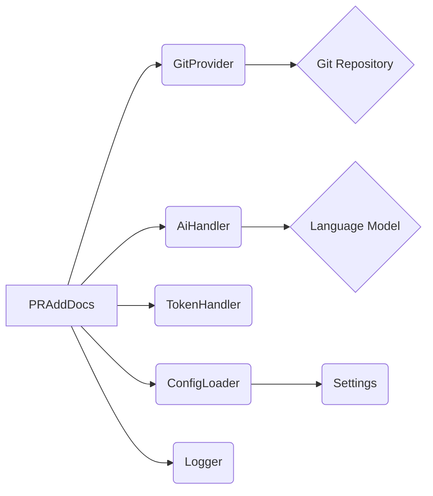
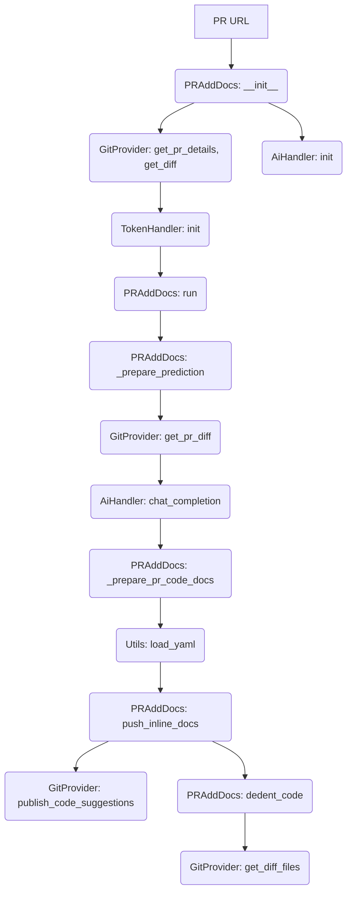

# Documentation for pr_add_docs Module

## Overview

The `pr_add_docs` module is a tool within the PR-Agent system designed to automatically generate and add documentation to code changes within a Pull Request (PR). It leverages AI to understand the code modifications and produce relevant documentation, which can then be applied as suggestions or comments on the PR.

## Core Components

### PRAddDocs

- **`PRAddDocs`**: This is the main class in the module. It orchestrates the process of generating documentation for a given PR.

  - **`__init__(self, pr_url: str, cli_mode=False, args: list = None, ai_handler: partial[BaseAiHandler,] = OpenAIHandler)`**:
    - Initializes the `PRAddDocs` object.
    - Takes the PR URL, CLI mode flag, optional arguments, and an AI handler as input.
    - Sets up the Git provider, determines the main programming language of the PR, and initializes the AI handler.
    - Prepares a dictionary `vars` to hold PR information like title, branch, description, language, diff, extra instructions, commit messages, and language-specific documentation style.
    - Initializes a `TokenHandler` for managing tokens based on the PR and prompt settings.

  - **`run(self)`**:
    - The main method to execute the documentation generation process.
    - Logs the start of the process and publishes a temporary comment on the PR.
    - Calls `_prepare_prediction` to get the AI's generated documentation.
    - Calls `_prepare_pr_code_docs` to parse the AI's response.
    - If documentation is found, it proceeds to `push_inline_docs` to apply the suggestions.
    - Handles exceptions and logs errors.

  - **`_prepare_prediction(self, model: str)`**:
    - Prepares the data needed for the AI model to generate documentation.
    - Retrieves the PR's diff using `get_pr_diff`.
    - Calls `_get_prediction` to get the AI's response.

  - **`_get_prediction(self, model: str)`**:
    - Generates the AI prediction for documentation.
    - Renders system and user prompts using Jinja2 environment with PR variables.
    - If verbosity is enabled, logs the prompts.
    - Calls the AI handler's `chat_completion` method to get the response.

  - **`_prepare_pr_code_docs(self) -> Dict`**:
    - Parses the AI's prediction (which is expected to be in YAML format).
    - Loads the YAML content and returns it as a dictionary. Handles cases where the prediction is a list.

  - **`push_inline_docs(self, data)`**:
    - Pushes the generated documentation as code suggestions on the PR.
    - Iterates through the parsed documentation data.
    - For each documentation entry, it extracts relevant file, line number, documentation content, and placement.
    - Uses `dedent_code` to format the documentation snippet.
    - Publishes the suggestions using `git_provider.publish_code_suggestions`.
    - Includes fallback logic to publish suggestions individually if the bulk publish fails.

  - **`dedent_code(self, relevant_file, relevant_lines_start, new_code_snippet, doc_placement='after', add_original_line=False)`**:
    - Adjusts the indentation of the generated documentation snippet to match the surrounding code.
    - Retrieves the original code lines from the diff.
    - Calculates the indentation difference and applies it to the new code snippet.
    - Optionally adds the original line of code to the snippet.
    - Handles potential exceptions during the dedenting process.

### Helper Function

- **`get_docs_for_language(language, style)`**:
  - Returns the appropriate documentation type string based on the programming language and a specified style.
  - Supports Java (Javadocs), Python/Lisp/Clojure (Docstrings), JavaScript/TypeScript (JSdocs), and C++ (Doxygen).
  - Defaults to "Docs" for unsupported languages.

## Architecture and Dependencies

The `PRAddDocs` module interacts with several other components:

- **`pr_agent.git_providers`**: This module is crucial for interacting with Git repositories and fetching PR information. `PRAddDocs` uses `get_git_provider()` to instantiate the appropriate Git provider (e.g., GitHub, GitLab) based on the PR URL. It relies on the Git provider to get PR details, diffs, files, and to publish comments and suggestions.
- **`pr_agent.algo.ai_handlers`**: This module provides the AI capabilities. `PRAddDocs` uses an instance of `BaseAiHandler` (specifically `OpenAIHandler` by default) to communicate with the language model for generating documentation content.
- **`pr_agent.algo.token_handler`**: Used to manage token usage, ensuring that the prompts sent to the AI model do not exceed token limits.
- **`pr_agent.algo.utils`**: Provides utility functions like `load_yaml` for parsing AI responses and `get_main_pr_language` for determining the primary language of the PR.
- **`pr_agent.config_loader`**: Used to load configuration settings, including `extra_instructions` for documentation and prompt templates.
- **`pr_agent.log`**: Used for logging information and errors throughout the process.

### Diagram: Component Interaction



### Diagram: Data Flow



## Module Integration

The `pr_add_docs` module is a specialized tool that can be invoked by the main PR-Agent system. When triggered, it focuses on enhancing the PR by adding necessary code documentation, thereby improving code quality and maintainability. It integrates seamlessly with the existing Git provider abstractions and AI handling mechanisms of the PR-Agent.

## Usage

The `PRAddDocs` class is typically instantiated with a PR URL and then its `run` method is called to initiate the documentation generation process. Configuration for prompts and AI models is managed through the `config_loader` and can be customized via settings.

Example (conceptual):

```python
# Assuming pr_url is the URL of the Pull Request
pr_docs_generator = PRAddDocs(pr_url=pr_url)
await pr_docs_generator.run()
```
