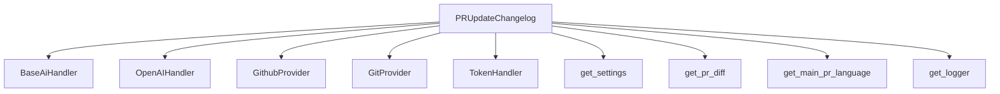
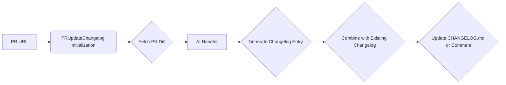

# Documentation for pr_changelog_update Module

## Overview

The `pr_changelog_update` module is responsible for automatically updating the CHANGELOG.md file of a project based on the changes introduced in a pull request. It leverages AI to summarize the changes and format them appropriately for the changelog.

## Core Components

### PRUpdateChangelog

- **Description:** This class is the main component of the module. It orchestrates the process of fetching PR information, generating changelog entries, and optionally updating the CHANGELOG.md file.
- **Initialization:**
    - `pr_url` (str): The URL of the pull request.
    - `cli_mode` (bool): Flag to indicate if the module is running in CLI mode.
    - `args`: Additional arguments passed to the module.
    - `ai_handler` (partial[BaseAiHandler]): The AI handler to be used for processing. Defaults to `OpenAIHandler`.
- **Key Methods:**
    - `run()`: Executes the changelog update process. This includes fetching the PR diff, preparing the AI prediction, and either publishing the generated changelog as a comment or committing it to the CHANGELOG.md file.
    - `_prepare_prediction(model: str)`: Fetches the PR diff and calls `_get_prediction` to get the AI-generated changelog entry.
    - `_get_prediction(model: str)`: Generates the changelog entry using the configured AI model and prompts. It formats the diff and other PR details before sending them to the AI.
    - `_prepare_changelog_update()`: Prepares the new content for the CHANGELOG.md file by combining the AI-generated entry with the existing content. It also formats the answer to be displayed to the user.
    - `_push_changelog_update(new_file_content, answer)`: Commits the updated changelog content to the CHANGELOG.md file in the repository. It also attempts to create a review comment on the PR with the changelog updates.
    - `_get_default_changelog()`: Returns a default changelog template if no existing CHANGELOG.md is found.
    - `_get_changelog_file()`: Fetches the current content of the CHANGELOG.md file from the repository.

## Dependencies

This module has dependencies on several other modules:

- **AI Handlers:** It utilizes AI handlers for natural language processing and generation. Specifically, it depends on `pr_agent.algo.ai_handlers.base_ai_handler.BaseAiHandler` and `pr_agent.algo.ai_handlers.openai_ai_handler.OpenAIHandler`.
- **PR Processing:** Functions for processing pull request differences are used from `pr_agent.algo.pr_processing`.
- **Token Handling:** `pr_agent.algo.token_handler.TokenHandler` is used for managing token usage.
- **Utilities:** Helper functions for utilities like model type and configuration display are imported from `pr_agent.algo.utils`.
- **Configuration:** Settings are loaded from `pr_agent.config_loader.get_settings`.
- **Git Providers:** It interacts with various git providers to fetch PR information and update files. Key dependencies include `pr_agent.git_providers.github_provider.GithubProvider` and the generic `pr_agent.git_providers.git_provider.GitProvider`.
- **Logging:** Uses `pr_agent.log.get_logger` for logging information and errors.

## Architecture and Data Flow

1.  **Initialization:** The `PRUpdateChangelog` class is initialized with the PR URL and configuration settings. It determines the main language of the PR and fetches the current `CHANGELOG.md` content.
2.  **Run Execution:** The `run()` method is called to start the process.
3.  **Diff Calculation:** The `_prepare_prediction` method fetches the PR's diff using `get_pr_diff`.
4.  **AI Prediction:** The `_get_prediction` method sends the PR diff, along with other PR details (title, description, branch, etc.), to the configured AI handler to generate a changelog entry.
5.  **Changelog Preparation:** `_prepare_changelog_update` combines the AI-generated entry with the existing changelog content.
6.  **Output:**
    - If `push_changelog_changes` is enabled and the git provider supports it (e.g., GitHub), the `_push_changelog_update` method commits the changes to `CHANGELOG.md`.
    - Otherwise, the generated changelog updates are published as a comment on the PR.

## Usage Example

```python
# Assuming you have a PR URL and necessary configurations set up
pr_url = "https://github.com/user/repo/pull/123"
changelog_updater = PRUpdateChangelog(pr_url)
await changelog_updater.run()
```

## Mermaid Diagrams

### Component Interaction Diagram



### Data Flow Diagram


