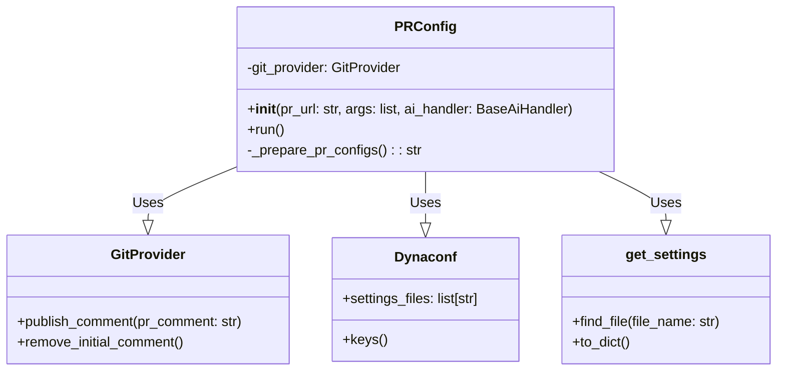
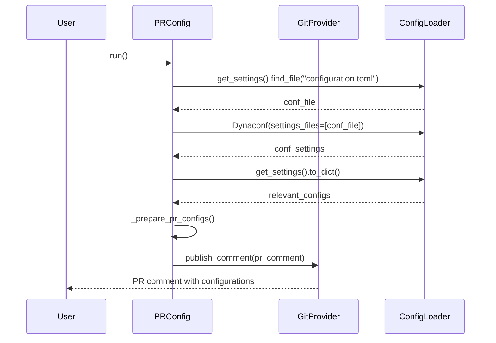

# PR Config Module Documentation

## Introduction

The `pr_config` module provides a way to display the current configuration settings used by the PR-Agent. It gathers all relevant configuration parameters and formats them into a comment that can be posted on a pull request. This allows users to easily view and understand the current configuration, aiding in debugging and customization.

## Architecture

The `PRConfig` class is the main component of this module. It interacts with the `config_loader` module to retrieve the current settings, and with a `git_provider` to publish the configuration as a comment on the pull request.

## Core Component: `PRConfig`

The `PRConfig` class is responsible for:

*   Initializing with a pull request URL and optional arguments.
*   Fetching the current configuration settings.
*   Formatting the settings into a human-readable format.
*   Publishing the formatted settings as a comment on the pull request.

### Methods:

*   `__init__(pr_url: str, args=None, ai_handler=None)`: Initializes the `PRConfig` object. It takes the pull request URL, optional arguments, and an AI handler as input. It also initializes the `git_provider` using [git_provider](git_provider_base.md).
*   `run()`: Orchestrates the process of fetching, preparing, and publishing the configuration settings. It calls the `_prepare_pr_configs()` method to format the settings and then uses the `git_provider` to publish the comment.
*   `_prepare_pr_configs() -> str`: Retrieves the configuration settings, filters out sensitive information, and formats the settings into a markdown string. This string is then returned for publishing.

## Data Flow

## Security Considerations

The `PRConfig` class takes care to skip keys that might contain sensitive information, such as tokens, secrets, and keys. The `skip_keys` list is used to filter out these sensitive settings before publishing the configuration. Also, `identity_provider` and `secret_provider` are skipped. See [identity_providers](identity_providers.md) and [secret_providers](secret_providers.md) for more information.

## Relationships with Other Modules

*   **config_loader**: The `PRConfig` module uses the `config_loader` module to load the configuration settings.  See [config_loader](pr_reviewer.md) for more information.
*   **git_providers**: The `PRConfig` module uses the `git_providers` module to interact with the Git provider and publish the configuration as a comment on the pull request. See [git_providers](git_provider_base.md) for more information.
*   **ai_handlers**: The `PRConfig` module can receive an AI handler during initialization, although it is not directly used in the current implementation. This suggests a potential future integration with AI-powered features. See [ai_handlers](ai_handlers.md) for more information.

