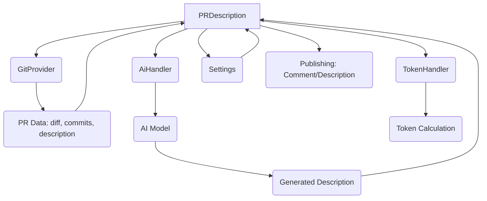
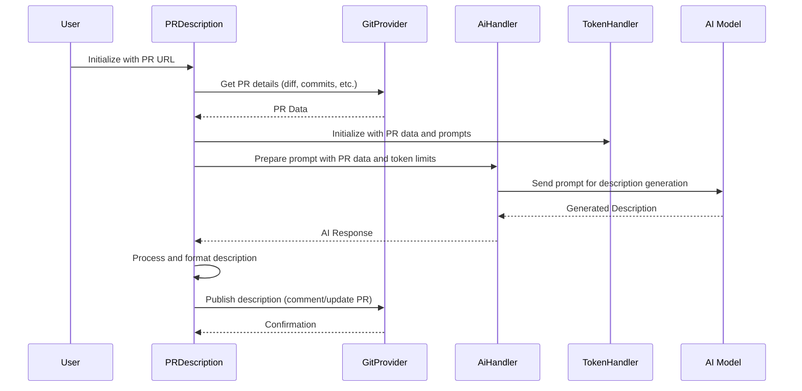
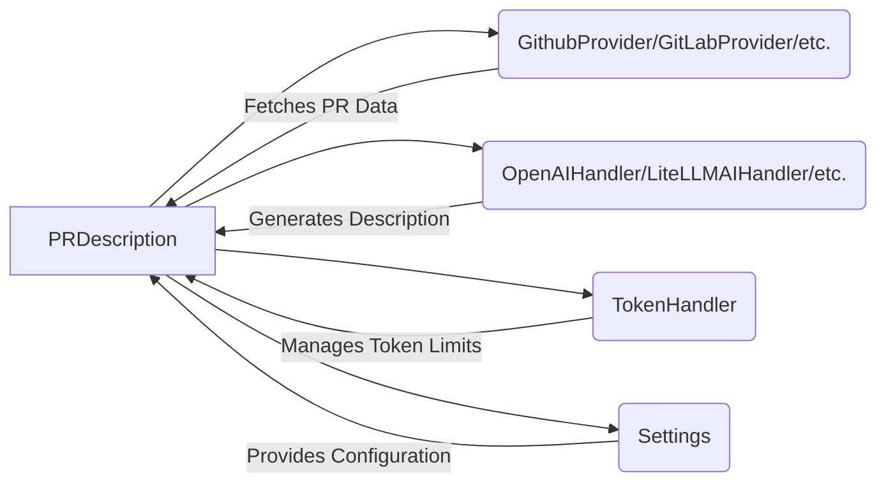

# PR Description and Docs Module (`pr_agent.tools.pr_description`)

## Introduction

The `pr_agent.tools.pr_description.PRDescription` module is responsible for automatically generating a comprehensive description for a given pull request (PR). It leverages AI models to analyze the PR's code changes, commit messages, and existing description to create a detailed and informative summary. This module plays a crucial role in enhancing the clarity and understanding of PRs within a development workflow.

## Core Components

### `PRDescription` Class

The `PRDescription` class is the main component of this module. It orchestrates the process of fetching PR data, interacting with AI models for description generation, and publishing the results.

#### `__init__(self, pr_url: str, args: list = None, ai_handler: partial[BaseAiHandler,] = OpenAIHandler)`

Initializes the `PRDescription` object.

**Parameters:**

*   `pr_url` (str): The URL of the pull request to be described.
*   `args` (list, optional): A list of arguments passed to the class. Defaults to None.
*   `ai_handler` (partial[BaseAiHandler,], optional): The AI handler to be used for generating the description. Defaults to `OpenAIHandler`.

#### `run(self)`

This asynchronous method executes the PR description generation process. It handles:
*   Fetching PR details using the `git_provider`.
*   Interacting with AI models (via `ai_handler` and `token_handler`) to generate the description.
*   Processing and formatting the AI's output.
*   Publishing the generated description as a PR comment or updating the PR description itself, based on configuration.
*   Handling different scenarios like large PRs and custom labels.

## Architecture Diagram



## Data Flow Diagram



## Component Interaction Diagram



## Usage Example

```python
# Assuming you have a PR URL and necessary configurations set up
pr_url = "https://github.com/user/repo/pull/123"
description_generator = PRDescription(pr_url)
await description_generator.run()
```

## Dependencies

*   **Git Providers**: Interacts with various git providers (e.g., `GithubProvider`, `GitLabProvider`) to fetch PR data.
*   **AI Handlers**: Utilizes AI handlers (e.g., `OpenAIHandler`, `LiteLLMAIHandler`) for natural language processing and description generation.
*   **Token Handler**: Manages token limits for AI model interactions.
*   **Configuration**: Reads settings from `pr_agent.config_loader`.

## Related Modules

*   [AI Handlers](./ai_handlers.md)
*   [Git Providers](./git_providers.md)
*   [Utilities and Types](./utilities_and_types.md)
