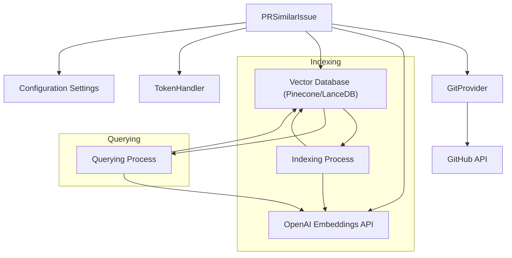

# Module: pr_similar_issue_detection

## Introduction

The `pr_similar_issue_detection` module is designed to identify and report issues that are similar to a given issue within a GitHub repository. It leverages AI and vector databases (Pinecone or LanceDB) to find semantically related issues and comments, helping developers to avoid duplicate efforts and discover relevant discussions.

## Core Components

This module consists of the following core components:

*   **`PRSimilarIssue`**: The main class responsible for orchestrating the similar issue detection process. It handles repository interaction, AI embedding generation, vector database querying, and comment publishing.
*   **`IssueLevel`**: An enumeration representing the type of content, either an 'issue' or a 'comment'.
*   **`Metadata`**: A Pydantic model for storing metadata associated with each issue or comment, including repository name, username, creation timestamp, and content level.
*   **`Record`**: A Pydantic model representing a single record in the corpus, containing a unique ID, the text content, and its associated metadata.
*   **`Corpus`**: A Pydantic model that holds a list of `Record` objects, representing a collection of issues and comments.

## Architecture and Component Interaction

The `PRSimilarIssue` class is the central orchestrator. It interacts with:

1.  **Git Provider**: It uses the `get_git_provider()` to interact with GitHub repositories, fetching issues, comments, and repository details.
2.  **AI Handler (OpenAI Embeddings)**: It utilizes OpenAI's embedding model (`text-embedding-ada-002`) to convert issue and comment text into vector representations.
3.  **Vector Database (Pinecone or LanceDB)**: It stores and queries these embeddings. The module supports both Pinecone and LanceDB, configurable via settings.
    *   **Indexing**: When a repository is first processed, or if `force_update_dataset` is true, the module indexes all issues and their comments. It creates embeddings for each and stores them in the chosen vector database.
    *   **Querying**: For a given issue, it generates an embedding and queries the vector database for the most similar entries within the same repository.
4.  **Token Handler**: Used to manage and count tokens to stay within model limits.
5.  **Settings**: Reads configuration from `get_settings()` for various parameters like vector database choice, API keys, and maximum issues to scan.

### Data Flow

1.  **Initialization**: `PRSimilarIssue` is initialized with an issue URL and an AI handler. It sets up the Git provider and parses the repository and issue number.
2.  **Indexing (if needed)**:
    *   Fetches all issues from the repository.
    *   Processes each issue: extracts header, body, and comments.
    *   Generates embeddings for issue text and comments using OpenAI.
    *   Stores these embeddings along with metadata (repo, username, timestamp, level) in the configured vector database (Pinecone or LanceDB).
3.  **Querying**:
    *   Fetches the target issue and processes its content.
    *   Generates an embedding for the target issue's text.
    *   Queries the vector database for similar embeddings, filtered by the repository.
    *   Retrieves the top `k` similar issues/comments.
4.  **Reporting**:
    *   Formats the results, including issue titles, URLs, and similarity scores.
    *   Publishes the results as a comment on the original issue using the Git provider.

### Diagram: Component Interaction



## Dependencies

*   **`pr_agent.algo.token_handler.TokenHandler`**: For managing token counts.
*   **`pr_agent.algo.utils`**: For utility functions like `get_max_tokens`.
*   **`pr_agent.config_loader.get_settings`**: To load configuration settings.
*   **`pr_agent.git_providers.get_git_provider`**: To obtain the appropriate Git provider (specifically GitHub in this module).
*   **`openai`**: For generating text embeddings.
*   **`pinecone` / `pinecone_datasets`** (optional): If Pinecone is used as the vector database.
*   **`lancedb`** (optional): If LanceDB is used as the vector database.
*   **`pandas`** (optional): Used in conjunction with Pinecone.

## How it fits into the overall system

This module acts as a specialized tool within the PR Agent system. It enhances the PR Agent's ability to understand the context of a pull request or an issue by identifying related discussions. This can help in:

*   **Preventing duplicate issues**: By highlighting existing similar issues.
*   **Providing context**: Offering developers relevant past discussions or solutions.
*   **Improving review efficiency**: By surfacing related problems or fixes.

## Configuration

The behavior of this module is controlled by settings in the configuration file, primarily under the `pr_similar_issue` section:

*   `vectordb`: Specifies the vector database to use ('pinecone' or 'lancedb').
*   `max_issues_to_scan`: The maximum number of issues to scan when indexing a repository.
*   `force_update_dataset`: If true, forces re-indexing of the entire dataset.
*   `skip_comments`: If true, comments are not included in the similarity search.
*   `pinecone.api_key`, `pinecone.environment` (if using Pinecone).
*   `lancedb.uri` (if using LanceDB).
*   `openai.key`: OpenAI API key.

## Usage Example

```python
# Assuming you have initialized the PR Agent and have an issue URL
from pr_agent.agent.pr_agent import PRAgent
from pr_agent.algo.types import PRInfo

# Example: Initialize with a specific issue URL
issue_url = "https://github.com/example/repo/issues/123"
# ai_handler would be an instance of a BaseAiHandler subclass
# ai_handler = LangChainOpenAIHandler() # or other handler
# agent = PRAgent(ai_handler=ai_handler)
# await agent.handle_pr_similar_issue(issue_url=issue_url)

# Or directly use the PRSimilarIssue class if needed for specific tasks
# from pr_agent.tools.pr_similar_issue import PRSimilarIssue
# ai_handler = LangChainOpenAIHandler() # or other handler
# similar_issue_detector = PRSimilarIssue(issue_url=issue_url, ai_handler=ai_handler)
# await similar_issue_detector.run()
```
