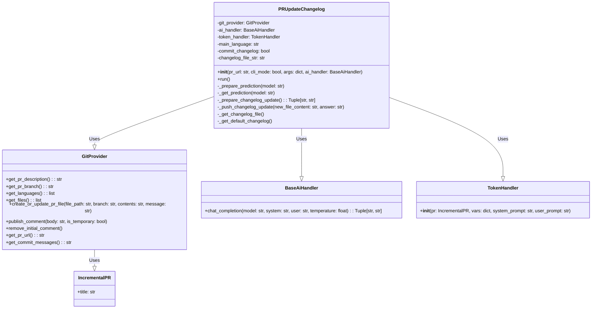
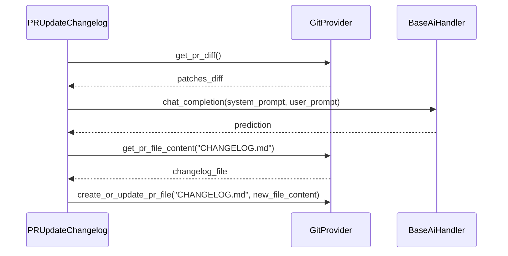

# PR Update Changelog

## Introduction

The `pr_update_changelog` module provides functionality to automatically update the `CHANGELOG.md` file in a pull request. It analyzes the changes introduced by the PR and suggests relevant entries for the changelog, which can then be committed to the repository.

## Architecture

The `PRUpdateChangelog` class is the main component of this module. It interacts with the `GitProvider` to fetch PR details and modify files, and uses an `AIHandler` to generate changelog suggestions based on the PR diff.

## Core Components

### PRUpdateChangelog

This class orchestrates the changelog update process. It fetches the PR diff, interacts with the AI handler to generate suggestions, and updates the `CHANGELOG.md` file.

#### Initialization

The constructor initializes the `PRUpdateChangelog` object with the PR URL, CLI mode, arguments, and an AI handler. It also retrieves the Git provider, main language, and changelog file content.

#### Run

The `run` method is the main entry point for updating the changelog. It prepares the AI prediction, prepares the changelog update, and pushes the changes to the `CHANGELOG.md` file.

#### Internal Methods

*   `_prepare_prediction(model: str)`: Gets the PR diff and generates the AI prediction.
*   `_get_prediction(model: str)`: Generates the AI prediction using the system and user prompts.
*   `_prepare_changelog_update() -> Tuple[str, str]`: Prepares the changelog update by combining the AI prediction with the existing changelog content.
*   `_push_changelog_update(new_file_content: str, answer: str)`: Pushes the updated changelog content to the `CHANGELOG.md` file.
*   `_get_changelog_file()`: Retrieves the content of the `CHANGELOG.md` file from the Git provider.
*   `_get_default_changelog()`: Returns a default changelog template if the `CHANGELOG.md` file does not exist.

## Data Flow

## Dependencies

*   **GitProvider**: This module relies on the [git_provider](git_provider_base.md) abstraction to interact with different Git platforms (e.g., GitHub, GitLab). See the documentation for specific implementations like [github_provider](github_provider.md), [gitlab_provider](gitlab_provider.md), etc.
*   **BaseAiHandler**: This module uses an AI handler to generate changelog suggestions.  See [ai_handlers](ai_handlers.md) for more information.
*   **TokenHandler**: This module uses TokenHandler to handle token limits. See [utilities_and_types](utilities_and_types.md) for more information.

## Module Configuration

The following configurations are available for the `pr_update_changelog` module:

*   `pr_update_changelog.push_changelog_changes`: Whether to automatically push the changelog changes to the repository.
*   `pr_update_changelog.extra_instructions`: Extra instructions to pass to the AI model.
*   `pr_update_changelog.add_pr_link`: Whether to add a link to the PR in the changelog entry.
*   `pr_update_changelog_prompt.system`: The system prompt used to generate the changelog suggestions.
*   `pr_update_changelog_prompt.user`: The user prompt used to generate the changelog suggestions.

These configurations can be set in the `config.toml` file.
