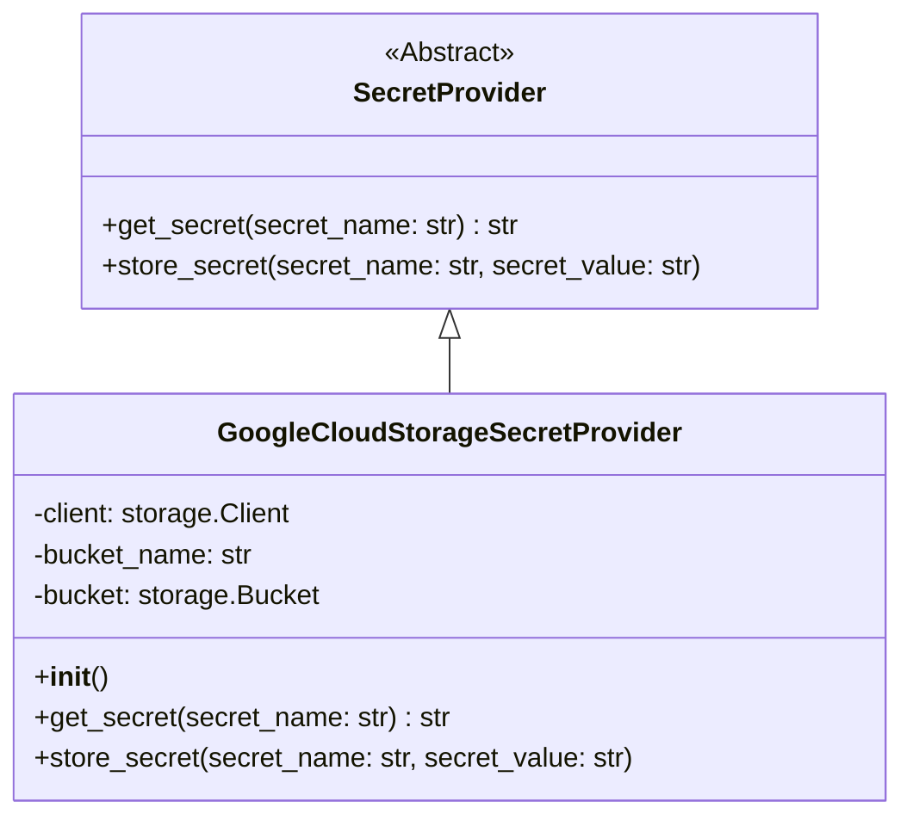

# Secret Providers Module

This module provides an abstraction layer for securely storing and retrieving secrets, such as API keys and credentials. It defines a common interface for different secret storage backends.

## Architecture

The `secret_providers` module follows a simple architecture with an abstract base class `SecretProvider` and concrete implementations for specific storage solutions.

## Core Functionality

### SecretProvider (Abstract Base Class)

The `SecretProvider` class defines the interface for all secret provider implementations. It ensures that any concrete provider will have methods for getting and storing secrets.

- **`get_secret(secret_name: str) -> str`**: Abstract method to retrieve a secret by its name.
- **`store_secret(secret_name: str, secret_value: str)`**: Abstract method to store a secret with a given name and value.

### GoogleCloudStorageSecretProvider

This concrete implementation of `SecretProvider` uses Google Cloud Storage as the backend for storing and retrieving secrets.

- **Initialization**: It initializes by connecting to Google Cloud Storage using service account credentials and specifies the bucket name.
- **`get_secret(secret_name: str) -> str`**: Downloads the secret content from a specified blob (secret name) in the configured Google Cloud Storage bucket.
- **`store_secret(secret_name: str, secret_value: str)`**: Uploads the secret value to a specified blob (secret name) in the configured Google Cloud Storage bucket.

## Related Modules

- [Configuration Loading](config_loader.md): The `secret_providers` module relies on configuration settings loaded from `pr_agent.config_loader.get_settings()`, which may include credentials and bucket names for secret storage.
