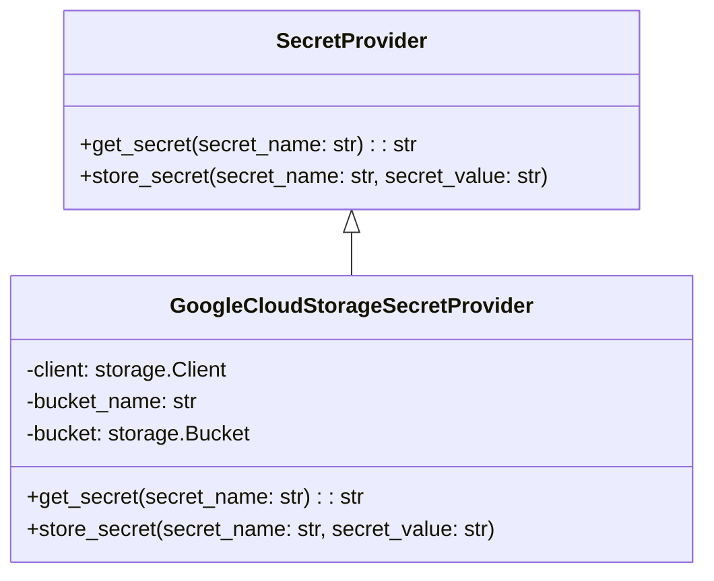

# Secret Providers Module Documentation

## Introduction

The `secret_providers` module is responsible for securely managing and retrieving secrets used by the PR-Agent. It provides an abstraction layer to access secrets from different storage locations, preventing hardcoding sensitive information directly in the application code. This module enhances security and simplifies secret management.

## Architecture

The `secret_providers` module consists of the following components:

### Components

- **`SecretProvider`**: An abstract base class that defines the interface for all secret providers. It declares the `get_secret` and `store_secret` methods.
- **`GoogleCloudStorageSecretProvider`**: An implementation of `SecretProvider` that retrieves and stores secrets from Google Cloud Storage. It uses the `google-cloud-storage` library to interact with the storage service.

## Functionality

The `secret_providers` module offers the following functionalities:

- **Abstraction**: Provides a consistent interface (`SecretProvider`) for accessing secrets, regardless of the underlying storage mechanism.
- **Retrieval**: Fetches secrets by name using the `get_secret` method.
- **Storage**: Stores secrets by name and value using the `store_secret` method.
- **Implementation**: Implements the `SecretProvider` interface with `GoogleCloudStorageSecretProvider` to manage secrets in Google Cloud Storage.

### Sub-modules

- **`GoogleCloudStorageSecretProvider`**: For detailed information, see [GoogleCloudStorageSecretProvider Documentation](google_cloud_storage_secret_provider.md).

## Integration with other modules

The `secret_providers` module is used by other modules to retrieve secrets required for their operation. For example, the `ai_handlers` module might use it to get the API keys for different AI models. The `config_loader` module uses the secret providers to retrieve secrets defined in the configuration. See [PRConfig documentation](pr_config.md) for more details.
