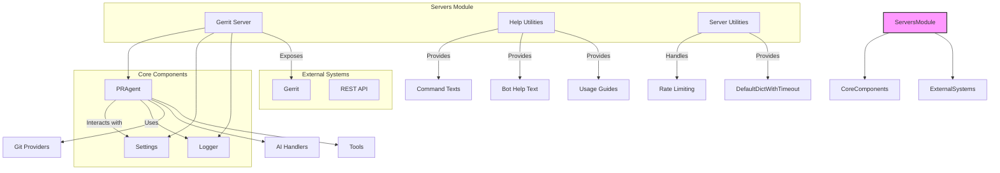
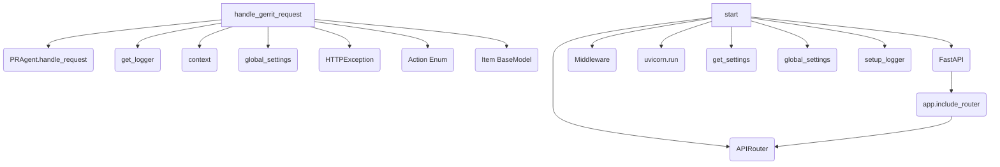
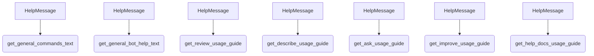
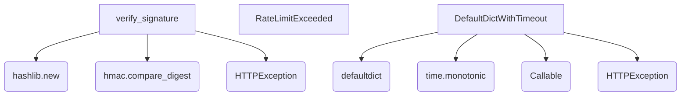

\
# Servers Module Documentation

## Overview

The `servers` module provides the necessary components to expose the PR-Agent's functionality through various server implementations. It handles incoming requests, processes them using the core PR-Agent logic, and returns the results. This module is crucial for integrating the PR-Agent with external systems like Gerrit, or for providing a RESTful API.

## Architecture

The `servers` module acts as the entry point for external interactions with the PR-Agent. It defines different server implementations and utility functions to manage requests and responses.

## Sub-modules

### Gerrit Server (`pr_agent.servers.gerrit_server`)

This sub-module provides the implementation for serving the PR-Agent functionality through a Gerrit-compatible interface. It defines API endpoints to handle actions like `review`, `describe`, `ask`, `improve`, and `reflect`.

- **Core Components**:
  - `Action`: An Enum defining the possible actions that can be performed.
  - `Item`: A Pydantic model representing the data structure for incoming requests.
  - `handle_gerrit_request`: An asynchronous function to handle incoming Gerrit requests, parse them, and delegate to the `PRAgent`.
  - `start`: A function to initialize and run the FastAPI application for the Gerrit server.

**Dependencies**:
- Relies on `pr_agent.agent.pr_agent.PRAgent` for core agent functionality.
- Uses `pr_agent.config_loader.get_settings` and `pr_agent.config_loader.global_settings` for configuration.
- Utilizes `pr_agent.log.get_logger` and `pr_agent.log.setup_logger` for logging.

### Help Utilities (`pr_agent.servers.help`)

This sub-module provides static methods for generating help texts and usage guides for the PR-Agent commands. This is useful for providing user-friendly documentation and command-line help.

- **Core Components**:
  - `HelpMessage`: A class containing static methods to generate formatted text for:
    - `get_general_commands_text()`: Lists available commands.
    - `get_general_bot_help_text()`: Provides general instructions on how to invoke the bot.
    - `get_review_usage_guide()`: Detailed usage guide for the review command.
    - `get_describe_usage_guide()`: Detailed usage guide for the describe command.
    - `get_ask_usage_guide()`: Detailed usage guide for the ask command.
    - `get_improve_usage_guide()`: Detailed usage guide for the improve command.
    - `get_help_docs_usage_guide()`: Detailed usage guide for the help_docs command.

**Dependencies**:
- Primarily a utility module, does not have significant external dependencies within the PR-Agent codebase beyond standard Python libraries.

### Server Utilities (`pr_agent.servers.utils`)

This sub-module contains utility functions and classes that are helpful for server implementations, particularly for handling web requests and managing resources.

- **Core Components**:
  - `verify_signature`: A function to verify the signature of incoming requests, commonly used for webhook security (e.g., GitHub).
  - `RateLimitExceeded`: A custom exception class to indicate that an API rate limit has been exceeded.
  - `DefaultDictWithTimeout`: A specialized dictionary that extends `collections.defaultdict` with a time-to-live (TTL) feature for its items. This is useful for caching or managing temporary data with automatic expiration.

**Dependencies**:
- `verify_signature` depends on `hashlib`, `hmac`, and `fastapi.HTTPException`.
- `DefaultDictWithTimeout` depends on `collections.defaultdict`, `time`, `typing.Any`, `typing.Callable`, and `fastapi.HTTPException`.

## Module Integration

The `servers` module integrates with the core `PRAgent` to expose its capabilities. The `gerrit_server` specifically acts as a bridge to Gerrit, translating Gerrit events into actions that the `PRAgent` can understand and execute. The utility components within `servers.utils` and `servers.help` support the robustness and usability of these server implementations.

## Mermaid Diagrams

### Servers Module Architecture

### Gerrit Server Component Diagram

### Help Utilities Component Diagram

### Server Utilities Component Diagram

