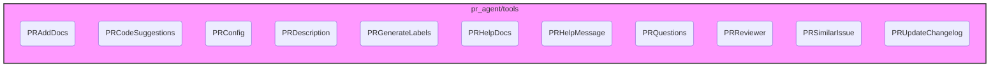

## `tools` Module Overview

The `tools` module provides a collection of classes, each implementing a specific action or tool that the PR-Agent can perform on a pull request. These tools range from generating descriptions and labels to providing code suggestions and updating changelogs. The module acts as a central hub for various functionalities, allowing the PR-Agent to interact with and modify pull requests in a structured and modular way.

Each class within the `tools` module inherits from a base class (implicitly or explicitly) and implements a `run()` method that executes the tool's primary function. The tools often interact with other modules, such as `git_providers` (to fetch PR data and post comments), `ai_handlers` (to generate text using LLMs), and `utilities_and_types` (for token handling and data structures).

Here's a brief description of each tool:

*   **`PRAddDocs`**: Adds documentation to the PR.
*   **`PRCodeSuggestions`**: Provides code suggestions for the PR.
*   **`PRConfig`**: Displays the current configuration settings used by the PR-Agent. See [pr_config](pr_config.md) for more information.
*   **`PRDescription`**: Generates a description for the PR.
*   **`PRGenerateLabels`**: Generates labels for the PR.
*   **`PRHelpDocs`**: Provides help documentation for the PR-Agent.
*   **`PRHelpMessage`**: Displays a help message with available commands.
*   **`PRQuestions`**: Asks questions about the PR.
*   **`PRReviewer`**: Reviews the PR and provides feedback.
*   **`PRSimilarIssue`**: Identifies and presents similar issues to the current PR. See [pr_similar_issue](pr_similar_issue.md) for more information.
*   **`PRUpdateChangelog`**: Automatically updates the `CHANGELOG.md` file in the PR. See [pr_update_changelog](pr_update_changelog.md) for more information.