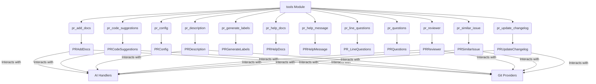

# The `tools` Module

## Purpose

The `tools` module in the PR-Agent system provides a collection of specialized functionalities designed to automate various aspects of the Pull Request (PR) lifecycle. These tools leverage AI and direct interaction with Git repositories to enhance code quality, improve documentation, streamline reviews, and manage PR-related information. Each tool addresses a specific task, allowing for modular and extensible automation.

## Architecture

The `tools` module is structured to encapsulate distinct functionalities, each represented by a dedicated sub-module. These sub-modules often contain a primary class responsible for orchestrating the tool's operation, interacting with AI handlers, Git providers, and other utility components.

## Core Components Documentation

The `tools` module comprises several sub-modules, each focusing on a specific task:

*   **`pr_add_docs`**:
    *   **Purpose**: Automatically generates and adds documentation to code changes in a PR.
    *   **Core Component**: `PRAddDocs` class.
    *   **Documentation**: [pr_add_docs.md](pr_add_docs.md)

*   **`pr_code_suggestions`**:
    *   **Purpose**: Analyzes code changes and generates actionable code suggestions.
    *   **Core Component**: `PRCodeSuggestions` class.
    *   **Documentation**: Part of [pr_code_suggestions_and_review.md](pr_code_suggestions_and_review.md)

*   **`pr_config`**:
    *   **Purpose**: Manages and applies PR-related configurations.
    *   **Core Component**: `PRConfig` class.
    *   **Documentation**: [pr_config.md](pr_config.md)

*   **`pr_description`**:
    *   **Purpose**: Automatically generates a comprehensive description for a PR.
    *   **Core Component**: `PRDescription` class.
    *   **Documentation**: [pr_description.md](pr_description.md)

*   **`pr_generate_labels`**:
    *   **Purpose**: Generates relevant labels for a PR based on its content.
    *   **Core Component**: `PRGenerateLabels` class.
    *   **Documentation**: [pr_generate_labels.md](pr_generate_labels.md)

*   **`pr_help_docs`**:
    *   **Purpose**: Provides help and documentation related to PR processes.
    *   **Core Components**: `PredictionPreparator`, `PRHelpDocs` classes.
    *   **Documentation**: [pr_help_docs.md](pr_help_docs.md)

*   **`pr_help_message`**:
    *   **Purpose**: Generates helpful messages and guidance for PR interactions.
    *   **Core Component**: `PRHelpMessage` class.
    *   **Documentation**: [pr_help_message.md](pr_help_message.md)

*   **`pr_line_questions`**:
    *   **Purpose**: Handles questions related to specific lines of code within a PR.
    *   **Core Component**: `PR_LineQuestions` class.
    *   **Documentation**: Part of [pr_question_answering.md](pr_question_answering.md)

*   **`pr_questions`**:
    *   **Purpose**: Manages and answers general questions about a PR.
    *   **Core Component**: `PRQuestions` class.
    *   **Documentation**: Part of [pr_question_answering.md](pr_question_answering.md)

*   **`pr_reviewer`**:
    *   **Purpose**: Performs comprehensive reviews of PRs, identifying potential issues and suggesting improvements.
    *   **Core Component**: `PRReviewer` class.
    *   **Documentation**: Part of [pr_code_suggestions_and_review.md](pr_code_suggestions_and_review.md)

*   **`pr_similar_issue`**:
    *   **Purpose**: Detects and reports issues that are semantically similar to a given issue or PR.
    *   **Core Components**: `PRSimilarIssue`, `Metadata`, `Corpus`, `Config`, `IssueLevel`, `Record` classes.
    *   **Documentation**: [pr_similar_issue_detection.md](pr_similar_issue_detection.md)

*   **`pr_update_changelog`**:
    *   **Purpose**: Automatically updates the CHANGELOG.md file based on PR changes.
    *   **Core Component**: `PRUpdateChangelog` class.
    *   **Documentation**: [pr_update_changelog.md](pr_update_changelog.md)