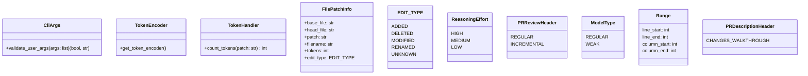

# Utilities and Types Module Documentation

This module contains utility classes, data structures, and type definitions used throughout the PR-Agent application. It provides core functionalities for handling CLI arguments, token encoding, file patch information, and various utility functions.

## Architecture

The `utilities_and_types` module does not have a complex architecture but provides essential building blocks for other modules. It includes:

-   **CLI Argument Handling**: Parses and validates command-line arguments.
-   **Token Handling**: Encodes and counts tokens for language models.
-   **Data Types**: Defines data structures for representing file patches and other relevant information.
-   **Utility Functions**: Offers a collection of utility functions used across the application.

## Sub-modules and Components

### 1. CLI Argument Handling

-   **`CliArgs`**: This class provides a static method `validate_user_args` to validate command-line arguments passed to the application. It checks for forbidden arguments and returns a boolean indicating whether the arguments are valid.

    -   See: `pr_agent.algo.cli_args.CliArgs`

### 2. Token Handling

-   **`TokenEncoder`**: This class provides a static method `get_token_encoder` to get the token encoder based on the model specified in the settings. It uses the `tiktoken` library to encode strings and count the number of tokens in them.
-   **`TokenHandler`**: This class handles token-related operations, such as counting the number of tokens in a given text. It uses the `TokenEncoder` to encode strings and provides methods to calculate the number of tokens accurately, considering different language models.

    -   See: `pr_agent.algo.token_handler.TokenEncoder` and `pr_agent.algo.token_handler.TokenHandler`

### 3. Data Types

-   **`FilePatchInfo`**: A dataclass that stores information about a file patch, including the base file, head file, patch content, filename, number of tokens, edit type, and other relevant details.
-   **`EDIT_TYPE`**: An enumeration that defines the possible edit types for a file patch (e.g., added, deleted, modified).
-   **`Range`**: A dataclass that represents a range of lines and columns in a file.
-   **`ModelType`**: An enumeration that defines the possible model types (e.g., regular, weak).
-   **`PRReviewHeader`**: An enumeration that defines the possible PR review header types (e.g., regular, incremental).
-   **`ReasoningEffort`**: An enumeration that defines the possible reasoning effort levels (e.g., high, medium, low).
-   **`PRDescriptionHeader`**: An enumeration that defines the possible PR description header types (e.g., changes walkthrough).

    -   See: `pr_agent.algo.types.FilePatchInfo` and `pr_agent.algo.types.EDIT_TYPE`

### 4. Utility Functions

-   **`ReasoningEffort`**, **`PRReviewHeader`**, **`ModelType`**, **`Range`**, **`PRDescriptionHeader`**: These are utility classes and enums that provide additional functionality and type definitions used throughout the application.

    -   See: `pr_agent.algo.utils`

## Integration with Other Modules

The `utilities_and_types` module is a foundational module that provides essential functionalities to other modules in the PR-Agent application. For example:

-   The `ai_handlers` module uses the `TokenHandler` to manage tokens when interacting with language models. See [ai_handlers.md](ai_handlers.md)
-   The `git_providers` module uses the `FilePatchInfo` data structure to represent file patches. See [git_providers.md](git_providers.md)
-   The `tools` module uses the `CliArgs` to validate user arguments. See [tools.md](tools.md)

This module does not depend on any other module.
